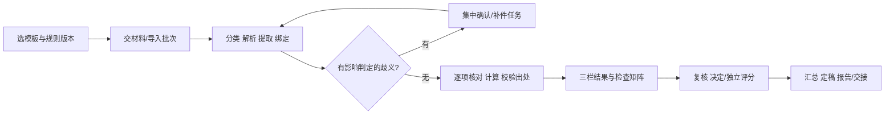

# 通用审核 Agent：产品、角色与模板

日期：2026-10-03。本文定义最终行为。每项功能均需交付，顺序不代表删减范围。

## 1. 用户负责业务意图，系统负责执行准备

模板负责人只需回答：审什么、需要什么材料、符合哪些要求、如何评分、谁做决定、最终交付什么。上传制度或用自然语言描述要求后，Agent 自动起草模板，提出必要的歧义问题，并把结果呈现为可编辑业务表单。

模板发布一次，可用于一整个审核批次。普通提交者只上传/填必要信息，审核人员集中处理待确认事项。系统自动分类、读取、拆分、绑定、校验、计算、组织结果、起草补件及反馈。它不能把无法读取的材料当成已检查，也不能替用户编造事实、证明或制度。

用户不需要写 JSON、Prompt、正则、脚本、图数据库查询或模型供应商代码。高级模式可以查看导出的结构化模板，但普通使用路径不依赖它。

## 2. 开箱即用的六种完整模板

| 内置模板 | 对象/可自动提取字段 | 核心检查 | 结果 |
| --- | --- | --- | --- |
| 学生综测 | 学生、学期、成绩、申请事项、等级、时间、组织方、证明 | 等级、适用年限、材料、分值映射、互斥、共享上限、加权汇总 | 原申报/建议/最终分、事项决定、汇总表、补件/异议 |
| 活动材料审批 | 个人或组织、活动、参与名单、时间地点、预算、负责人 | 资格、名额/预算、时间地点冲突、必须附件、签章要素、内容要求 | 可通过/部分通过/退回/补件、审批单 |
| 奖学金资格与推荐 | 学生、成绩/排名、资格、申请类别、推荐/证明 | 门槛、资格、重复申请、必交材料、截止时间、名额 | 资格结论、推荐清单、部分通过、复审 |
| 项目/比赛评委 | 团队/项目、摘要、申报类型、成果、评分维度 | 形式资格、量表适用、证据充分性、评分完整性、评委回避 | 独立评分、评语、汇总、分歧、同分与排名定稿 |
| 费用材料核对 | 报销事项、金额、币种、票据、时间、预算/批准额度 | 合计、标准限额、票据要素、重复、日期、单据一致性 | 可报金额/待核验项/超标准明细、审批摘要 |
| 文件/协议要求核对 | 文档、主体、条款、附件、版本、关键日期/金额 | 必备条款、附件引用、跨文档一致性、明确要求、风险提示 | 按检查项符合性、具体修改建议、来源对照 |

六个模板均带虚构示例政策、完整材料、可预期的符合/问题/补件结果。所有示例明确标“模拟”，不冒充 CDUT 正式校规。制度分值和门槛来自当前选定版本，内置样例不能默默成为真实申请的依据。

模板可复制并改名称、字段、材料要求、规则、评分、流程和输出；从空白创建第七种业务也必须能运行，不增加新页面或改产品代码。文件条款核对结果依给定要求生成，不能自动冒充法律意见；票据识别不等于外部真伪验真。

## 3. 完整功能清单

| ID | 必须做到的功能 | 用户减少的工作 | 验收 |
| --- | --- | --- | --- |
| F01 | 首次启动自检、示例、复用全局模型配置、显式模型选择与能力提示 | 不用重复配渠道/装解析工具/查日志 | A01/A16 |
| F02 | 模板库、对话起草、业务表单编辑、流程编排、试跑、发布、复制/导入/导出 | 不用工程师为每种审核写专用页面 | A02/A15 |
| F03 | 多制度/通知/口头要求转规则，确认、冲突、适用范围、版本与优先级 | 不用反复手抄细则或每案解释口径 | A06 |
| F04 | 文件/多选/拖拽/文件夹/ZIP/表格分案，分类预览、去重、替换与停用 | 不用逐文件点选、重命名、手工分案 | A03/A12 |
| F05 | 动态字段提取、来源保留、条目拆分合并、人工纠错与字段确认 | 只处理识别不确定项，已确定项自动填 | A05 |
| F06 | 证据事实提取、多对多绑定、候选归属、复用/重复计分判别、原件查看 | 不用一张张找证书并反复对照 | A04 |
| F07 | 形式/资格/内容/一致性检查，逐项完整覆盖，合法零问题结果 | 不用手工维护核对清单 | A08 |
| F08 | 可计算规则、分组与批次汇总、评分量表、精度/舍入/同分处理 | 不用抄分、算上限、算平均分/名额 | A07/A14 |
| F09 | 自动运行、阶段进度、待输入/待决定、取消/重试/续跑、增量重审 | 不用点多个独立 AI 按钮或从头重跑 | A11/A18 |
| F10 | 三栏原件与列表联动、校规蓝色、问题红黄、多出处导航与窄屏定位 | 不用另开软件找页码或定位问题 | A08 |
| F11 | 人工确认/更正/误报/保留意见、事项与案卷决定、审批阶段记录 | 结果可以直接处理，责任与状态清楚 | A09 |
| F12 | 合并补件清单、模板化说明、期限、履行/取消、补件后自动关联和重审 | 不用另做缺件表、复制说明、逐条找原问题 | A09 |
| F13 | 退回、撤回、复审、申诉、版本差异与结果通知包 | 不用凭聊天记录猜曾经作过什么决定 | A10 |
| F14 | 批次锁定模板/规则、运行队列、批量确认、状态筛选、汇总与名册 | 老师能处理整个班级或评审批次 | A12 |
| F15 | 评委分配/回避、独立量表、匿名视图、缺评和分歧、汇总定稿 | 不用另建多套评分表再手工合并 | A14 |
| F16 | 面向学生/审核人/组织者的报告，MD/PDF/XLSX/JSON/完整交接包 | 不用从截图/内部 ID 手拼交接材料 | A13 |
| F17 | 案卷内快捷助手、真实引用、修改/补件/规则调整草案及确认后应用 | 用户不懂怎么修时得到针对本案的操作帮助 | A13 |
| F18 | 本地完整运行、离线材料包往返、校方业务适配器、模拟接口、共享模式契约 | 现在无 API 也能演示完整流程，接校方时更换数据连接 | C01–C04/S01–S03 |

## 4. 角色任务与页面

主导航增加审核区内部的“待办/批次、模板、案卷、评审汇总”，仍保留原三栏为案卷核心。用户从任务进入，案卷打开后看到当前版本、责任人、阶段、材料覆盖、下一步和完整历史。

| 工作视图 | 默认关注 | 常用动作 | 能看到的结果 |
| --- | --- | --- | --- |
| 学生/提交者 | 我的材料、自检、缺件与反馈 | 上传、修正提取字段、补件、撤回、申诉 | 本人可公开的建议/决定；内部评语不外泄 |
| 初审审核员 | 待处理异常与事实核验 | 对照原件、纠错、绑定、确认/退回、提出补件 | 本案检查矩阵、依据、自己的任务与处理历史 |
| 老师/终审者 | 批次进度、分数、尚未解决的问题 | 批量确认、复核、处理例外、定稿 | 规则版本、分值来源、人工记录、完整交接报告 |
| 评委 | 被分配的项目与评分维度 | 回避、打分、评语、提交、授权重开 | 自己的材料与评分；其他评委结果按阶段开放 |
| 评审组织者 | 分配、缺评、分歧、汇总、名额 | 分配/替补、复核分歧、确定同分办法、冻结/发布 | 审查汇总、有效评分数量、排名及对外反馈 |
| 模板负责人 | 模板与政策是否能执行 | 起草、编辑、测试、发布/停用、版本升级 | 草案问题、试跑差异、受影响批次 |

本地模式提供上述任务/角色视图、具名人工记录和往返材料包；单机用户可以演示各阶段。联网模式用认证主体、组织范围与服务端授权控制读取/修改/发布，不以 UI 隐藏代替权限。多位评委离线评分必须在各自工作副本中独立完成，由组织者导入具 reviewerId 的评分包；共享同一机器切角色只能用于演示，不能宣称真实匿名独立评审。

学生自查只产生自查结果、修正和补件回复，不能生成“教师已批准”的决定。审批/评分操作记录执行主体、来源（local/mock/校方认证）、任务与阶段；由业务服务校验动作，UI 负责呈现允许操作。本地演示切换角色后可演练老师批准，但输出必须保留本地模拟身份，不能冒充学校授权。

## 5. 从零到可复用模板的路径

默认路径为六步向导，已有模板只需确认变更项。每一步都有 Agent 草案和自然语言说明。

### 5.1 审什么

配置审核对象为个人、组织、项目、文件、交易或自定义；显示用名称、编号、周期按模板设置，学年不是全局必填。单案可以包含多个事项；批次包含多个独立案卷，不能把整班学生混成一个多文件事项。

字段支持文本、数字/金额、日期/时间、枚举、多选、布尔、对象、重复行表、附件引用；配置必填/条件必填、单位、合法范围、抽取提示和对外可见性。申报分数仅用于需要的模板；无评分业务没有“0 分”占位。

### 5.2 交哪些材料

配置材料槽：名称、用途、条件、类型、数量、关键要素、能否同一文件复用。Agent 对输入分类、识别槽和归属；无法判定时把多个候选一并问用户。学号/姓名冲突不能自动把甲的证明归给乙。

已有政策可能要求证书日期、颁发单位、参加人数或盖章；系统把这些变成提取要素和检查项。印章是否存在与印章真实性必须分开记录。

### 5.3 按什么要求审

规则可来自文档条款，或负责人直接输入的要求。后者显示“负责人要求 + 录入者/时间/版本”，不伪造政策文档页码。Agent 先提取草案，用户确认适用条件、数字、例外和优先级后发布。

一条规则至少含：标题、适用对象/条件、要检查的要求、关联字段/材料、输出结果、来源、有效期、例外/优先关系、执行类型。规则模板为：

- 必填/必须材料、文件数量、时间范围、枚举/等级映射。
- 数值/金额限制、按次/按小时计分、分组累计、共享上限、权重/舍入。
- 同一事项去重、互斥/择高、跨材料字段一致性。
- 必须条款/内容要求、语义匹配、依据不足需人判断。
- 评分量表及资格前置条件。

页面使用“当【条件】成立，检查【字段/材料】满足【要求】，否则【待补件/不符合/待确认】”的表单。`且/或/非` 可嵌套；业务运算由已注册算子生成，不把自由输入当代码执行。

同一规则的例外可覆盖一般项；多份依据之间不能自动假设“后上传的更权威”或“学院一定优先”。未明确的冲突成为待确认任务；其他无冲突检查继续执行，受影响事项不出确定结论。

### 5.4 如何给分或作结论

选择无评分、规则计分、量表评分、资格后评分或混合。定义结果枚举、总分公式、组内择高/互斥、上下限、N/A 策略、评委数量、权重、缺评策略、同分处理和名额。

确定计算保存输入、规则与计算明细；AI 分数是单独建议，评委分数是人工记录。评分空白与零分不同，不适用项不按零分扣分。量表描述可由 Agent 起草，发布时必须确认每档标准。

### 5.5 谁来处理、何时结束

默认提供“自检”“单级审核”“初审→终审”“资格→独立评委→汇总”四种流程，可以增加/排序/条件启用阶段。阶段类型包括自动检查、人工复核、独立评分、补件等待、汇总、定稿和交接。

配置阶段进入/退出条件、执行角色、处理范围、截止时间、必要人数、可跳过原因、复审回到哪一阶段。系统预置自动检查内部步骤，负责人通常只编排业务阶段。高级流程支持依赖/条件分支/并行评分；画布和表单编辑同一配置，不能产生两套不一致的模板。

模板可选择辅助审核或在限定条件下自动通过。默认人工终审；负责人启用自动通过时，必须定义允许自动决定的范围和条件。存在未读必需材料、未完成检查、规则冲突、未确认关键事实或必需人工评分时，自动通过条件不成立。拒绝、例外核准和校方回写由模板中明确有权的主体决定。

### 5.6 输出什么、试跑与发布

选择审批单、分项反馈、补件单、分数表、批次名册、评分矩阵等，可编辑展示列与公开范围。系统内置可读默认输出。

试跑同时展示规则命中、跳过理由、待补件、覆盖、计算和报告。发布检查：无悬空字段/引用、无流程循环、未解决冲突不会被确定执行、评分有明确范围/缺失策略。发布生成不可变版本；复制或修改生成新草稿。升级批次显示影响预览，已定稿案件保留原版本，批次重审必须显式选择迁移范围。

## 6. 一次审核的自动过程

一次点击“开始审核”完成全部可自动的步骤；无需先点大纲再点识别再点运行。允许背景执行其他案卷，当前页面按案卷/运行版本隔离。只因真正影响判定的信息缺失而暂停相应分支，并合并问题，避免每页都问一次。

材料量超出模型单次容量时自动分批，保留每页/每文件处理状态。预算用尽、能力不足或失败时显示尚未检查的范围，允许继续，不把未完成变成没有问题。

## 7. 结果和状态必须让用户分得清

| 层级 | 状态/结果 | 含义 |
| --- | --- | --- |
| 检查项 | 符合、不符合、待补件、待确认、不适用、未执行、执行失败 | “不适用”带条件理由；“未执行”带原因；每条适用规则都有结果 |
| AI 建议 | 建议通过、建议部分通过、建议退回、建议补件、无法给出整体建议 | 来自当前输入，不代表负责人已经批准 |
| 人工决定 | 通过、部分通过、退回修改、拒绝、撤回 | 记录做决定的人、时间、理由、适用版本与事项范围 |
| 案卷阶段 | 草稿、已提交、审查中、待补件、待复核、待评分、待终审、已决定、已归档 | 当前责任人/任务；审批结果与流程位置分别保存 |
| 运行 | 排队、运行、等待输入、等待决定、暂停、已完成、部分完成、失败、已取消 | 等待不等于失败；部分完成不能表示全部审核完成 |
| 结果有效性 | 当前、已过期、历史快照 | 材料/字段/模板/规则改动影响相关结论；旧结果可查看，不能混入当前报告 |

红色表示已核验且不满足明确要求，黄色表示信息不足/需处理。缺件通常黄色；逾期且制度明确规定拒绝时才产生“不符合”的独立结论。AI 怀疑真实性只能标“待外部核验”，不得直接标造假。

规则计算分、AI 量表意见、人工最终分分别展示来源和依据。没有确认的分值映射/公式时，规则计算分显示“待确认”，不填模型猜测值；允许 AI 给主观评分意见的模板须标“AI 建议”，不能自动写入评委或教师最终值。“未发现问题但覆盖未完整”和“全部适用检查符合”采用不同摘要；没有识别到有效事项时先提示确认对象或识别失败，不宣称零问题通过。

右栏默认列待处理，同时可查看符合项和全部检查。每个问题提供事实、依据、为什么、建议动作、所影响事项/分数、处理状态和全部出处。卡片也可以是案卷级或组级（如累计上限），不强迫附着于一个虚构事项。

## 8. 三栏与助手的具体行为

- 左栏列出全部依据、有效范围、版本、启用状态、规则和冲突；点击问题定位相应依据，始终蓝色，允许切换多个来源。
- 中栏在事项/证据/原件之间切换，支持 PDF 页图、图片、表格坐标与文本；问题定位红/黄并展开正确文件。无块坐标只定位文件/页并显示精度，不跳到首块冒充命中。
- 未知文件/版本引用显示无法核验及待处理，不提供猜测落点；已确认真实文件但缺块坐标时可以定位文件。引用存在仍需核对原文是否支持结论，两者分别展示。
- 右栏提供整体建议、覆盖、处理队列、计算与人工决定。失败时显示失败及重试，零问题只有在该版本适用检查都完成时才呈现为全部符合。
- 窄屏点击引用自动切换到目标栏，提供返回原问题动作。颜色之外同时显示文字/图标，键盘可访问。
- 助手默认读取选中事项/问题/本次运行，按需查真实原文；引用可导航。可起草修改、补件、申诉、评语和规则变更，展示改动后由有权用户应用。修改字段不等于修改证明原件；用户上传新原件作为新版本。
- 独立评委可选择只看资料摘要，隐藏 AI 建议分数和其他评委意见；评分提交前检查必需维度，组织者按流程开放反馈。

## 9. 当前没有学校 API，仍能完成业务演示

每种模板带一套可往返的材料包：政策、原件、提取字段、检查结果、补件任务、人工/评委记录和版本清单。学生导出补件回复包，老师导入后合并到原案卷；评委导出评分包，组织者按分配 ID 导入。重复导入不重复计分，旧版本回复显示冲突和差异。

本地模拟适配器能提供学生/申请列表、阶段任务、成绩字段、外部核验成功/失败、回写回执及版本冲突。演示流程使用真实文件解析和真实运行状态；模拟来源清楚标注。它检验数据契约，不宣称学校已经支持相应接口。

真实接入使用同样的对象、阶段、任务和报告，更换身份/权限/资料/交接适配器。校方已有审批流时，本模块成为 AI 预审与结果建议节点；校方流程系统决定最终权威状态，避免两套审批互相覆盖。

## 10. 容易遗漏的操作完成标准

- 模型选择复用全局渠道与凭证。本区展示实际渠道/模型、文字/视觉/工具能力及自检时间；修改全局配置后同步刷新。选定模型被禁用/删除或不满足本次能力时提示重新选择，保留任务，不静默调用另一渠道。
- 文件选择器、拖拽和导入服务使用同一份格式能力表。当前不支持的格式在入口说明原因；已收材料的损坏/加密/超限/未识别状态在清单保留。最终仍交付第 3 节要求的多选、ZIP、扫描和分案能力。
- 类别、问题类型和审核类型始终显示可读名称。未知扩展类型至少显示原始名称/值与待配置提示，不能变成空 badge；未知模板不能默认按综测审核。
- 更正字段、改规则和调绑定后有保存反馈、版本变化及受影响结果提示；忽略或例外保留操作者与原因，不抹掉原问题。补件回复与已核验满足分别显示。
- 重开案卷恢复最近运行、过期标记、待办与助手线程；历史选择明确版本。导出前显示报告类型/所选运行，成功后显示文件位置并可打开或另存；取消与失败分别反馈，不显示虚假成功。
