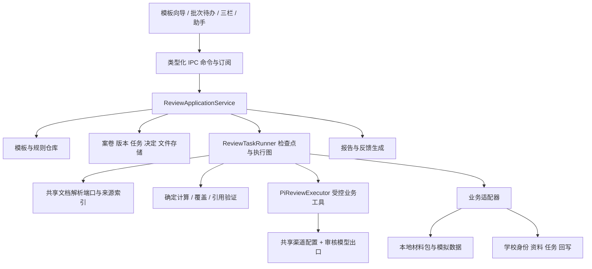

# 通用审核 Agent：架构、复用与交付依赖

日期：2026-10-03。本文接口和模块名凡未明确标“现有”，均为拟新增设计，不是当前可调用 API。

## 1. 总体结构



Electron 主进程管理文件、运行和业务动作；渲染层只通过 IPC 和 Jotai 显示状态。正常情况下无需启动 CDUTServer。学校接入作为业务适配器，不让 UI 或 Prompt 直接依赖某校 URL、Cookie 或数据列名。

模板定义业务流程，执行器生成可检查的执行图。Pi 负责语义理解、选择已注册工具补充检查和生成解释；程序负责数据版本、算术、来源验证、覆盖账本、流程推进和结果持久化。最终决定是独立业务动作。

## 2. 现有基座的复用与明确边界

| 现有能力/位置 | 已确认的内容 | 本模块如何复用/需要补什么 | 归属 |
| --- | --- | --- | --- |
| `channel-manager`、代理、配置路径、凭证 | 渠道/密钥/代理与用户配置已有 | 使用同一个渠道 ID；增加审核能力自检和显式选择，禁止审核另存密钥 | 基座接口共用 |
| `review/review-model-gateway.ts` | OpenAI 兼容与 Ollama 出口，超时和去图重试 | 提炼 ModelPort，支持取消/流式进度/结构化校验；任何去图都产生对应未检查记录 | 审核出口 + 基座协作 |
| `adapters/pi-agent-adapter.ts` | Pi 会话/事件/中止、自定义工具入口；也会组装通用工具 | 新增审核执行模式/端口，工具集合只装本案业务工具；模型流走审核允许的协议。直接套通用 headless runner 不等于此能力已实现 | Agent 成员提供执行端口，审核组提供工具 |
| `agent-session-manager`、事件总线 | 会话及日志存储 | 审核助手/语义节点可绑定 sessionId；业务真值仍在 ReviewCase/Run/Decision | 基座共用 |
| `packages/agent-fabric` 与 `main/lib/agent-fabric/` | Task 状态机、事件、请求幂等、文件 TaskStore 与 headless 桥 | 复用状态/事件思想与适配端口；现有服务默认需启用，重启会将运行任务标 expired，**没有审核检查点续跑**；不能以默认服务开关作为用户使用前提 | 运行公共契约，审核组补业务恢复 |
| `agent-fabric/approval.ts` | 工具权限审批绑定 | 属于工具权限，不能用作教师审批、评委打分或补件状态；另建业务 Decision/WorkflowTask | 审核组 |
| `document-parser.ts` 与附件管理 | 多格式纯文本提取、文件存储 | 保留纯文本接口，新加结构化解析入口及 OCR/原件定位。RAG/学业可以消费同一结构化文档，不共用业务事项 | 三组共享解析接口 |
| `packages/shared`、preload、IPC | 类型和四层调用机制 | Review V2 类型仍放 shared；同步类型/通道/handler/preload/renderer，不复制另一套 bridge | 审核组 |
| Jotai、Radix/shadcn、共享 UI | 状态、组件、主题已有 | 按 case/run/批次 ID 建状态映射，复用对话、文件预览、弹窗和列表 | 三组共用 UI |
| `review/case-store.ts`、`run-service.ts` | 案卷和 runs 的 JSON 保存 | 扩展版本快照、业务事务、检查点、历史查询与迁移；继续文件优先，不引入本地数据库 | 审核组 |
| `project-core` | 开发任务图与上下文 | 可借用纯图运算；开发任务的 review/status 不作为学生审批结果 | 按纯函数复用 |
| CDUTServer | 校园认证/个人资料和 AI 平台研究客户端 | 只作为未来 Connector 实现参考。现有文档无可用综测审核 API，不能当校方审批后端 | 对接成员；审核组定义端口 |

当前通用 Pi 模型层仍含其他协议路径，审核网关的白名单不能证明全局已完成协议收敛。审核运行和快捷助手都必须通过同一允许出口；全局删减其他厂商协议由公共模型层负责、三组共同验收。不能把 Ollama 的 Pi 默认协议映射直接当成已符合“本地私有接口”。

共享接口优先由三组确定一份版本契约：DocumentSource/解析、ModelPort/能力、AgentExecutor/事件、Artifact/预览。审核组不新做全局聊天页、渠道配置、校园 RAG 或学习笔记；业务规则、证据关联、覆盖、审批与评委属于审核模块。

## 3. 核心数据契约

| 实体 | 必要字段/关系 | 不变量 |
| --- | --- | --- |
| TemplateVersion | id/version/schemaVersion、对象 schema、材料槽、规则引用、评分、流程、输出、默认能力、发布状态 | 发布版不可变；模板导出不含凭证/学生材料 |
| PolicyVersion / RuleSpec | 原始文档版本或负责人要求、适用条件、执行 AST/语义标准、来源、优先/例外、确认人、有效期 | 未确认/冲突规则不能自动产生确定判定；不得默认首份生效 |
| ReviewBatch | 批次 ID、锁定模板/规则版本、案卷列表、时间/名额/分配配置 | 同一比较集合采用明确的一套规则；变更影响预览后产生新版本 |
| ReviewCaseV2 | ID、外部映射、对象类型、动态 fields、Subject 列表、文档版本、流程实例、revision | 学生学年/姓名按模板定义；运行不修改原申报值 |
| ReviewSubject | ID、type、fields、sourceRefs、当前修正层、事项状态 | 可以是事项、条款、项目、预算行；分数按需出现 |
| DocumentVersion | docId/versionId、contentHash、角色/材料槽/归属、原件路径、parseRevision、块/页/单元格、状态 | 同名文件不同版本；原始文件不改写；解析状态和审核使用状态分开 |
| Observation | subject/field、值/单位、来源、提取方式、确认状态、替代旧值关系 | 缺失与零值不同；AI 提取与人工修正均可回溯 |
| EvidenceLink | 证明版本/块、subjectId、支持的事实、候选/确认、复用范围 | 多对多；共享证书不自动等于重复申报；不同人归属不能仅凭文件名 |
| CheckResult | checkId/ruleId、目标 subject/group/case、状态、引用、理由、计算、执行方式 | 每个计划检查都有记录；不从 finding 数量推导覆盖 |
| ReviewFinding | 检查引用、影响范围、事实/依据、严重度、建议、处理状态 | 来自核验后的 CheckResult；案卷/组级可以无单个 itemId |
| ReviewRunV2 | runId、输入快照、执行图/检查点、状态、checks/findings、覆盖、模型/解析版本、诊断/用量 | 已完成结果不可改；补件或修正新建运行，保留前次 |
| BusinessDecision | 人/规则自动主体、阶段/事项范围、结果、分值、理由、基于 run/revision、时间 | AI 建议不是决定；更正追加新决定，不覆盖旧记录 |
| SupplementRequest / Appeal | 原问题/决定、所需材料/解释、责任人、期限、回复版本、状态 | 一次补件可解决多项；已交文件不自动表示补件被接受 |
| JudgeAssignment / Rating | reviewerId、范围、rubricVersion、回避、各维度 score/N/A、公开/内部意见、提交版本 | 独立评分；评分记录归属稳定，不能覆盖其他评委 |
| Handoff / SyncReceipt | 外部系统/案卷 ID、动作 ID、期望外部版本、内容 hash、回执、冲突 | 重试去重；只有收到成功回执才算外部提交成功 |

`SourceRef` 必须携带 `caseId/documentVersionId/parseRevision`，并采用下列一种位置：PDF/图片的页与可用矩形、表格 sheet/row/column、Word 段落/表格位置、纯文本字符范围，或明确的文件级定位。不存在准确坐标时不得填写假的 page=1/第一块。

材料事实为 `Observation`，RuleSpec 引用事实字段执行。计算结果和自然语言解释均关联同一输入。来源通过注册索引生成短引用 ID，模型只返回允许的引用 ID，再由服务转成真实 SourceRef；无法匹配则保留为待确认，不能以红色确定结论交付。

### 一个规则示例：综测项目择高和组上限

以下是**拟定内部表示片段**。最终 schema 应统一校验；用户编辑的是业务表单。

```json
{
  "id": "competition-group-score",
  "mode": "deterministic",
  "target": { "scope": "group", "groupBy": ["applicantId", "academicYear", "category"] },
  "when": { "all": [{ "field": "category", "op": "eq", "value": "competition" }] },
  "calculation": {
    "deduplicateBy": ["eventId"],
    "select": "highest-eligible-score",
    "valueFrom": "confirmedLevelScore",
    "aggregate": "sum",
    "cap": { "value": "10.00", "unit": "point" },
    "allocation": "score-desc-then-subject-id"
  },
  "onUnknown": "needs-confirmation",
  "sourceIds": ["policy-clause-7"]
}
```

示例 10 分是模拟规则。组内先按同一 eventId 择高，再聚合、封顶，最后依模板分配计入明细；只生成一份组级计算，不对每个问题卡独立减分。未知 eventId 或等级不能被当零分掩盖。模板没定义分配方法时只输出组级计入总额与待确认明细，不编造每项最终值。

## 4. 规则编译与执行

规则草案→来源核验→字段/类型校验→冲突/例外校验→人确认→发布→编译检查计划。计划包含资格/材料/字段/语义/计算/汇总检查，注明适用对象和依赖。

确定性算子使用有限条件树：all/any/not、存在性、比较、范围、日期、集合、字段相等、分组聚合、等级映射、择高/互斥、去重和权重。金额按币种最小单位或明确十进制定点数；分数按模板精度保存与舍入。跨币种未给汇率/日期时待确认，不自动相加。缺少输入进入 unknown 状态；三值逻辑由父条件保留，不能把 unknown 当 false 或 0。

语义规则明确标准、允许引用、可用事实和输出 enum。每次模型返回验证 schema、目标范围、来源、字段单位、规则适用及数值边界。来源合法不代表推理正确，需要验证引用片段是否支持断言；不支持时重取上下文/修复一次，仍不支持进入待确认。

Agent 提出的新检查只是建议检查；负责人未批准前不能提升为本批次强制拒绝规则。确定运算失败与业务不符合分别表示。确定引擎能独立运行已编译数值/形式规则，模型不可用时仍显示其真实检查结果，语义检查保留未执行；mock fixture 只存在显式演示模式。

## 5. Agent 工具和受控执行

| 拟新增业务工具 | 输入/输出 | 谁决定状态 |
| --- | --- | --- |
| `read_review_sources` / `search_review_sources` | 本案允许原件片段、版本、来源引用与使用清单 | 来源服务 |
| `propose_observations` / `propose_evidence_links` | 提取/绑定候选、置信理由及来源 | 校验后写候选；关键歧义由用户确认 |
| `evaluate_checks` | 已发布规则 ID/目标、结构化 CheckResult | 规则引擎/语义执行器 |
| `calculate_review_scores` | 合法事实和评分规则 | 程序，模型不能覆盖计算值 |
| `verify_review_references` | 断言与引用 | 来源验证器 |
| `request_review_input` | 合并后的字段/归属/规则歧义 | 创建持久待办，等待业务响应 |
| `draft_supplement_request` / `draft_feedback` | 待处理检查、所需材料/理由/期限 | 草稿生成；模板规则或有权人员发布 |
| `propose_review_patch` | 原值、新值、来源、影响预览 | 用户应用后新 revision，自动重审受影响项 |
| `prepare_review_report` | 当前运行/决定/评分版本 | 报告服务核对完整性与可见范围 |
| `query_external_review_fact` | 已配置连接能力与目标标识 | Connector 返回事实或不可用状态 |

工具不能让文档内“忽略规定/调用命令”等文字改变规则或工具集合。模型使用材料作为数据；业务工具只处理绑定 caseId/version 的资源。读取任意工作区、Shell 和全局发送工具不属于普通审核能力。

现有 Pi 的 `customTools` 是扩展入口，但当前仍会组装通用工具。需要增加“仅审核业务工具”的装配模式/预设，在公共 adapter 内实现并回归通用 Agent；不能仅追加 customTools 后声称已经隔离。模型调用同样新增流适配口，确保复用渠道与允许协议。

## 6. 自动运行图、覆盖和恢复

默认节点：

`校验模板 → 入库/分案 → 解析与 OCR → 提取事实 → 证据绑定 → 构建适用检查 → 确定/语义检查 → 组级计算 → 出处与覆盖验证 → 建议/补件 → 人工阶段 → 汇总/报告`。

节点输入输出都是结构化产物，可由模板启用/跳过/分支。语义节点内部允许 Pi 循环读取相关证据和纠正输出；计划、预算、引用范围由 Host 保存。独立文件/案卷可并行，组级计算等待所需前置；不让模型一次吞下整批所有材料。

单个输入版本内的依赖图必须无环。补件/退回引起业务重入时生成新 revision/run，并重用未受影响产物；不是在同一依赖图里制造循环。评分补交和制度更正遵循同样规则。

检查点保存 nodeId、inputHash、产物引用、完成/失败/等待状态、重试次数、待输入任务和事件游标。恢复读取已提交产物，只重做未完成/失效节点；不能把 Pi 会话恢复等同业务步骤已经恢复。

每份文件/页均有账本：已登记、成功解析、部分识别、未识别、用于哪些检查、未处理原因。每条计划检查均有结果。覆盖展示两组分母：**登记材料/可读材料/实际用于检查的材料**和**计划检查/完成检查/有效判定/待处理检查**。语义规则不适用时保留理由；未读页、图片超限、上下文溢出、无模型能力都是未完成范围。

重试默认有限次数，建议网络 2 次、结构化修复 1 次；具体由执行配置设定并记录，不需要模板用户调参。预算到达后变为可恢复暂停；取消中止模型/解析任务并记录已完成范围。UI 在步骤开始/结束/等待时更新，不输出“已经检查”而实际上只发送了请求。

### 并发与版本规则

- 每案写入在主进程串行；命令携带 `expectedRevision`，冲突返回当前版和差异，不能覆盖整份旧快照。
- Jotai 用 `casesById/runsById/tasksByCaseId`；选中 ID 与异步任务 ID 分开。完成 A 只更新 A；切 B 不解除 A 的运行守卫。
- 开始运行生成不可变输入 manifest/hash：模板/规则、文档版本/解析版本、事实修正、证据绑定、评分设置、外部事实版本。展示与导出核对同一 manifest。
- 改动只使依赖节点失效；累计上限/互斥/汇总/排名/名额有组或批次依赖，需同时使相关聚合失效。无法确定依赖时保守重审，不能为了增量漏算。
- 旧结论仍可作为带版本标记的历史报告导出；当前正式报告要求输入和决定基于同一有效版本。补件尚未解决则只能导出“预审/待补件”报告。
- 同一 `actionId/requestId` 重复执行返回原结果；补件发布、决定、评分导入、校方回写使用各自去重键，不重复计分或通知。

## 7. 文件存储、历史与迁移

继续使用 `getConfigDir()`；原有 `review-cases/{caseId}` 迁移为下列兼容结构，不引入本地数据库。

```text
review-templates/{templateId}/versions/{version}.json
review-policies/{policyId}/versions/{version}.json
review-batches/{batchId}/batch.json
review-cases/{caseId}/case.json
review-cases/{caseId}/source-docs/{versionId}/原件
review-cases/{caseId}/parsed/{versionId}/{parseRevision}.json
review-cases/{caseId}/snapshots/{revision}/manifest.json
review-cases/{caseId}/runs/{runId}/run.json
review-cases/{caseId}/runs/{runId}/checkpoints/{nodeId}.json
review-cases/{caseId}/events.jsonl
review-cases/{caseId}/decisions/...
review-cases/{caseId}/assistant/...
review-handoffs/...
```

写入采用临时文件、原子改名、事务操作记录及最终 commit 标记；跨文件更新完成前不发布新 manifest。恢复先处理未完成事务再读案卷。唯一 ID 不由文件名决定；块 ID 属于文档版本/解析版本，未重新解析时稳定。重新解析形成新 parseRevision，旧运行保留原解析快照，重新映射失败的引用标过期。

迁移 V1：保留原文件和 runs；创建兼容综测模板或对应领域模板，把旧分数转字段，fixture 保留 origin；历史 run 标“旧格式/覆盖未验证”。没有可信快照的历史不能升级成当前完整结论，需要重审。找不到原件时保留提取文本并标来源不全，不补造原件。迁移可重复执行、失败可恢复，测试覆盖未配置 domainPack、未知领域 ID、无 items、损坏文件和同名文件。

### 应用命令与查询契约

现有 14 条审核 IPC 可保留兼容桥，新增动作统一进入 ReviewApplicationService。修改命令共有 `requestId/actor/caseId或templateId/expectedRevision`；成功返回新 revision 和变更实体，冲突返回 `VERSION_CONFLICT` 与差异，不返回含糊的 false。用户错误、能力不可用、解析失败、运行失败分别有可呈现的错误码和建议动作。

| 命令/查询组（拟新增） | 核心入参/输出 | 直接承载的功能 |
| --- | --- | --- |
| 模板 draft/validate/test/publish/list/import/export | 草稿、版本、验证项、试跑输入、发布/兼容结果 | 模板编排与可迁移性 |
| 规则 extract/confirm/resolveConflict | 全部 policyVersionIds、草案、确认 patch、明确优先关系 | 多依据、确认、冲突 |
| 批次 import/assign/list/filter | 入库清单、分案候选、角色任务、条件筛选 | 批量整理与待办 |
| 材料 replace/deactivate/getPreview | documentVersionId、原件、预览资源、替代关系 | 修订/停用与原件定位 |
| 事实/证据 applyPatch | 类型化字段/绑定/拆分合并 patch、原值、理由、影响预览 | 人工纠错，应用后失效依赖 |
| 运行 submit/cancel/resume/retry/list/get | inputHash、runId、nodeId/待输入回复、预算、历史游标 | 非阻塞运行与恢复 |
| 运行 subscribe | caseId/runId、lastSequence → 有序事件/取消订阅 | 页面切换与进度重放 |
| 检查/finding resolve | checkId、确认/误报/保留、理由、basisRunId | 例外处理与人工记录 |
| 补件 create/respond/evaluate/cancel | 问题范围、材料槽、回复版本、受理动作 | 补件闭环 |
| 决定/申诉/复审 | taskId、范围、结果、分值、依据运行、理由 | 各级审批与异议 |
| 评委 assign/recuse/submit/reopen/aggregate/finalize | reviewerId、rubricVersion、评分、汇总策略、冻结版本 | 独立评分和排名 |
| 报告/助手/交接 | 明确 runId、decisionVersion、audience、格式、引用/patch/回执 | 同版报告、角色可见性、离线/校方交接 |

提交运行即时返回 runId 和排队状态，后台事件更新结果，避免 Renderer 等一个 150 秒 Promise 才知道完成。查询打开案卷返回当前快照、最近有效/过期运行、历史索引、待办及助手线程；导出明确指定运行，不能静默选“磁盘最近一个”。

案卷 `revision` 用于并发写冲突；审核运行 `inputHash` 只对影响审核的业务输入计算。处理意见、流程位置、助手消息等变更不让所有检查失效；修改事实/材料/规则/评分参数才触发依赖重审。报告仍读取所选运行保存的输入标题/来源，不将当前元数据拼到旧运行。这样用户确认一个问题后不会立刻让整轮结果成为过期。

## 8. 结构化解析和模型能力

解析端口返回文本层、页数/块、表格、图片资产和诊断。PDF 文本读取保留页与可用坐标；扫描页转图 OCR；DOCX 保留段落/表格结构，不能没有渲染就声称原 Word 页码；XLSX 保留 sheet/单元格、类型、公式与缓存值；CSV 保留列/行。原件预览和提取内容分别可见。

UI 接受的格式以解析能力注册表为准。目标必需：文本/扫描 PDF、DOCX、XLSX、CSV、PNG/JPEG、TXT/MD、PPTX；文件夹/ZIP 负责包装。DOC/XLS/RTF/ODT 等历史格式通过已打包解析/转换适配器支持后才能出现在接受列表，未支持者明确原因与替代格式，不能导入成功后漏审。ZIP 使用清单统计展开后实际文件，不执行嵌入内容；无法安全展开的包保留错误和原件。

优先扩展现有解析器。OCR/复杂布局候选 Docling/RapidOCR 等需用中文证书、多栏 PDF、表格样本比较准确度、启动时间、CPU/内存、运行资源和 Windows 打包；先确定端口再选后端。若本地 OCR 不足可经同一个 OpenAI 兼容视觉模型补读；无视觉模型但 OCR 成功时继续文本检查。所有无法读取的必需范围阻止完整通过。

首次启动读取已配置渠道，测试文字、图片、结构输出和工具调用能力并显示结果；能力是实测/声明/未知三种来源，不能仅从模型名称猜。分阶段路由绑定明确模型，不私自换外部服务。模板使用逻辑能力需求，执行配置使用 channel/model；导出模板不携带密钥。

## 9. 审批、补件、评委和报告服务

业务状态机由模板编译，区分结果、阶段和运行状态。先在本地完整执行。SupplementRequest 明确要素、文件槽、理由、期限和受影响检查；收到回复只标“已回复”，核验后标“已满足/仍不足”，创建增量运行并关联原问题。

人工复核记录原建议和覆盖范围。接受 AI 建议、手改值、误报、制度例外是不同操作；重跑不能删除已经存在的人工决定。新运行发现决定依赖变化时，决定标需复核。退回允许修改，拒绝是结果；申诉关联拒绝/计分决定，另有任务、复审人及结果版本。

评分服务固定量表版本；每评委一份 rating。汇总定义有效评委、N/A、缺评、权重、舍入、异常分歧阈值、同分和名额。可以平均/加权/中位/规则裁定，模板选定后同批次一致执行；不得默认去最高最低分，也不能默认给缺评零分。独立阶段锁住其他评委的评分可见范围，AI 建议默认隐藏且可配置。

报告从绑定的 run + input snapshot + decision/rating 版本生成，保留事实/规则短引用、材料清单、未检查范围、计算、补件、处理人/时间和版本；学生版过滤内部评语，评审版保留完整记录。PDF/XLSX 是可读输出，JSON/ZIP 是可往返数据；报告有类型标识（预审、待补件、已决定、历史），校方回执另展示。助手读取同样的版本化来源服务，所有可执行建议先成为 patch 草稿。

## 10. 学校系统和离线往返端口

拟新增 `ReviewIntegrationPort`：

| 方法 | 契约 |
| --- | --- |
| `describeCapabilities` | 身份/范围、资料、任务、核验、上传、决定、反馈支持项；不可用功能明确 |
| `resolveActorAndScope` | actorId、角色、组织/案卷范围、身份来源；本地手填身份明确 local |
| `listAssignments / fetchCaseBundle` | 外部案卷/学生/任务 ID、结构化字段、原件引用、来源/时间/版本、流程所有者 |
| `queryFact` | 成绩/活动/票据等事实，verified/unavailable/conflicting、来源、取得时间 |
| `submitSupplement / submitReviewRecommendation` | actionId、expectedExternalRevision、材料/检查/建议、回执 |
| `submitDecision / submitRating / publishFeedback` | 有权主体、版本、决定/评分、公开范围、幂等回执 |
| `readChanges` | 游标/变更版本；断线恢复后拉取并比较 |

提供 `LocalPackageAdapter`（文件往返）、`MockSchoolAdapter`（模拟身份/任务/事实/回执/冲突）和未来学校适配器。当前版本不绑定模拟学校的私有 URL 或任意 HMAC 算法。Connector 处理映射和认证，领域模型保持稳定。

联网协作的权威数据在共享服务/学校系统，本地作为工作副本；JSON 文件不能让不同电脑自动共同写同一案卷。应用服务抽象 Repository，联网替换为远程 Repository；离线采用基于 revision 的 patch/评分包合并。冲突由服务返回，不能以文件最后修改时间静默覆盖。

模型通信协议限制适用于推理通信：OpenAI 兼容及已登记本地私有接口。学校业务 API 是业务端口，按校方规范映射，不能为了“全部兼容 OpenAI”把学生查询或审批回写伪装成模型协议。任何校方专有 AI 通信也需在边界转换成允许协议；不直接接入审核执行器。

校方已有流程为 owner 时，Agent 输出建议/补件草稿并消费校方任务和回执；本地状态是同步镜像。独立流程为 owner 时，适配器按双方约定提交结果，不同时让两个系统推进同一阶段。

## 11. 交付依赖与可评审产物

| 阶段 | 完整交付内容 | 可核查产物/退出条件 | 解决差距 |
| --- | --- | --- | --- |
| M0 当前正确性 | 证明/多规则上下文、诚实状态、引用核验、案卷隔离、版本报告、分值守门；联动颜色/标签/格式接受表同步修正 | P1 复现全部变为正确行为；空发现不造假；未完整不冒充通过；K01–K07/K13 的 M0 部分通过 | G05/G06/G07/G08/G09/G10/G12/G15 |
| M1 V2 契约与模板 | 通用对象、规则 AST、六模板、向导/试跑/发布、迁移、主体/动作契约、显式模型选择与能力配置、数据端口 | 第七种业务只配模板跑通，旧案卷可读可重审；角色和模型来源不混淆 | G02/G03/G04/G07/G08/G16 |
| M2 材料与核对 | 原件预览/OCR/表格、事实/证明、条件/语义/计算、覆盖矩阵 | 真实文件和同名修订/多对多/上限等通过 A03–A08 | G05/G06/G08/G09/G10 |
| M3 Agent 自动执行 | Pi 审核工具装配、运行图、检查点、事件、取消/恢复、助手 | 一次启动运行，重启续跑、补件续跑、无跨案串写 | G11/G12/G15 |
| M4 业务完整闭环 | 决定/补件/复审/申诉、批次/评分/定稿、所有报告与离线往返 | 学生→老师、评委→组织者端到端通过 A09–A15 | G13/G14/G15/G16 本地部分 |
| M5 集成与产品交付 | 模拟与真实端口合同、权限/共享 Repository、打包依赖与引导 | 全 A/C 通过，真实校方配置具备后通过 S；安装包无开发依赖 | G02/G05/G16 |

M0→M1 为先决；M2 与模板 UI 可以基于冻结的 V2 契约分别实现；M3 依赖已稳定的业务工具；M4 的 UI 可提前开展，但退出依赖运行与版本正确；M5 接入设计从 M1 保留端口，实际联调依赖外部 API。这是依赖顺序，不是工期承诺。

先修正可信输入和状态，再建 V2 数据/模板，随后完成自动执行与闭环。不要继续添加领域 Prompt 来代替模板、计算和流程。每阶段提交包含对应 BDD 行为、固定材料/真值和可复核截图/报告；全部完成后按 04 验收，不能凭某一阶段通过宣称通用产品完成。

### 11.1 M0 修复契约

M0 修正现有服务及界面，允许先用与 V1 兼容的增量字段；进入 M1 时统一迁移到 V2。下表是现有落点与行为要求，不另建一套上传、模型管理或存储基座。

| 关联项 | 现有代码落点 | 必须具体改变什么 |
| --- | --- | --- |
| H01/H07 证明与来源 | `case-import.ts`、`document-service.ts`、`ai-review-service.ts`、`CenterPanel.tsx` | 导入登记所有文件/页，再提取事实并确认绑定；证明卡与源文件不是一对一数量关系。文本证明和图片请求携带可解析来源注册表；模型容量限制、超大图、扫描未读进入持久化覆盖账本，不只日志告警 |
| H02/H03 多规则与回退 | `ai-review-service.ts`、`LeftPanel.tsx`、`use-review-actions.ts` | 不再在真实流程使用首包代表全部依据；支持分文档生成/汇总，每条规则保留真实来源。失败保留已确认规则和诊断，未生成范围待处理；模拟 fixture 仅显式演示且版本匹配时可用 |
| H04/H07 结果解析与联动 | `parseFindings`、`RightPanel.tsx`、`SourceBlockView.tsx` | 允许 `findings=[]`，同时校验检查项、事项/来源归属和覆盖；状态渲染先区分排队/运行/失败/部分完成。伪引用不转为已核验红卡；依据侧固定蓝，真实文件级出处导航到文件容器 |
| H05/H06 并发与快照 | `use-review-actions.ts`、`review-atoms.ts`、`case-store.ts`、`run-service.ts` | 各异步操作捕获 caseId/runId/operationId/inputHash，状态按案卷及运行存取；存储使用 expectedRevision 与定向 patch，禁止拿调用前整案快照覆盖新字段；运行保存不可变输入 manifest 与输出 |
| H06/H09/H10 报告与恢复 | `report-service.ts`、运行查询 IPC、`selectCase` | 查询恢复最近运行及有效性，显式选择历史；导出指定 runId，读取其快照和相应记录，当前报告拒绝混版。V1 缺输入快照的旧运行可作为未经完整核验的历史查看，不能拼当前数据伪造历史报告 |
| H13 分值守门 | `ai-review-service.ts`、`mock-review-engine.ts`、共享结果类型 | 模型 `suggestedScore` 不能直接写规则计算结果；无确认映射/公式先待确认。已有确定算法须声明适用规则版本，不能把固定综测演示公式套到任意真实领域；主观 AI 量表意见单列 |
| H14/H15 展示与格式 | 领域解析/标签表、文件选择器、导入解析注册表 | 补全可读标签与未知值反馈，移除未知领域默认综测执行；接受表按真实已接通能力生成。扫描页未读及超限文件明确保留；M0 的诚实提示不替代 M2 的 OCR 和多文件能力 |

兼容旧模型只返回发现数组时，数组为空可以保存为“未发现问题”，但缺逐项执行证据仍标覆盖未知；用已登记的确定性检查记录补齐覆盖，或重新请求结构化检查，不能给全部事项批量填“符合”。零提取事项先区分无有效对象、识别失败、真正不适用；模板明确的案卷级检查仍可独立执行。

SourceRef 校验分两层：案卷/文件版本/块 ID 必须存在且在授权范围；原文还必须支持该事实或规则。存在的文件但精确块失效，只能展示经核验的文件级出处并说明精度；未知文件/错案引用只能标无法核验，不能使用第一份材料或依据替代。来源验证不通过的模型判断降为待确认并保留原回复，不能伪装成确定违规。

同类操作代次用于拒收被更新操作取代的旧响应，不用于全案所有任务互斥。A 的审核结束应保存到 A，即使用户正在 B；不能因当前页面不是 A 就丢结果。不同操作（提取/大纲）只有输入和修改范围兼容时可合并；否则返回 revision 冲突或待重新执行。主进程逐案串行提交，重读并验证来源版本后应用 patch。案卷选择的异步读取也使用选择代次，慢返回不得把界面切回旧案。

审核指纹覆盖模板/规则版本、适用领域/评分参数、有效材料内容及解析版本、事实和绑定；不是文件数/事项数或 updatedAt 的拼接。同数量下改日期、等级、替换文件也能被检测。备注/助手聊天不使检查全量失效；人工决定变化更新决定/报告版本，不能让旧报告冒充最新终审报告。旧运行只生成明确标识的历史快照；当前结果必须核对输入和记录版本。

### 11.2 补强实施依赖与现有代码落点

1. **先统一写入和版本契约**（H05/H06）：类型、主进程、preload、Renderer 同步，覆盖导入、大纲、提取、领域/模板变更及审核回写。直接在各按钮加当前案卷判断会遗漏持久化竞争，不能作为最终修复。
2. **接通材料与真实来源**（H01/H02/H07）：源 ID/版本注册表、全依据与证明上下文是覆盖和引用核验的共同输入。格式接受表/颜色/标签可在这些修改中一并完成；完整 OCR、原件结构在 M2 扩展相同端口。
3. **收紧失败、空发现、模拟和分数边界**（H03/H04/H13）：这部分可先独立消除错误兜底，但最终必须消费同一份检查和覆盖契约；不能用示例规则或示例算法掩盖未检查。
4. **建立同版恢复与输出，再接人工处理**（H06/H08/H09/H10）：历史查询依赖运行存储，人工更正依赖 patch/版本，最终报告依赖决定/备注持久化；恢复与报告不必等全部人工 UI 完成。完整格式和审批在 M4 验收。
5. **共享来源服务支撑助手**（H11）：线程用案卷 JSONL，查选中事项的真实申报/证明/规则，必要时检索更多片段并记录截断；回复引用重新核验，应用修改走同一 patch/权限入口，不向 Renderer 输出整案任意覆写。
6. **从 M1 固定角色、模板、模型与接入契约**（H12/H14/H16）：业务动作带主体/任务/阶段和身份来源，主进程校验动作；本地能力与真实认证边界分开。模型选择复用渠道配置事件，所选渠道删除/禁用时暂停需模型的阶段并提示，允许无模型依赖的计算继续；每次请求记录实际 channel/model/protocol，不悄悄替换。

这里允许按稳定接口分别开展界面与服务开发，但有输入/写入依赖的提交必须一起验证；不再沿用原计划“状态小改均互相独立”或“P2 按固定单链全部串行”的安排。各阶段退出条件取本章表格、04 的 A/C/S 及 K 回归交集；M0 中允许未读/待确认只证明没有虚称完成，不能直接作为最终 A03/A04/A08 通过证据。

### 11.3 版本、协作与验证约定

- 功能修改按仓库约定递增**受影响子包** patch 版本；shared 类型/IPC 与 Electron 实现须同步兼容。不是每一批都固定双升，也不是用包版本代替案卷 schemaVersion。文档整理无需改变产品版本。
- 每次可评审提交保持契约、服务、preload、Jotai/UI 和对应行为用例一致；是否拆分分支/PR按团队协作方式决定，不能拆成运行期不兼容的中间状态。其他成员继续复用渠道、Pi、公共解析/设置能力；审核模块负责业务状态、计算、来源和模板工具。
- 现有 AGENTS/CLAUDE/README 的更新遵守仓库授权约定；本轮没有产品功能变更，不改这些文件。实施功能变更时依据当时授权维护相关说明。
- 验证采用与改动相应的行为复现、类型/IPC检查及原生界面路径；发布时执行适用全量门禁。平台、模拟测试和模型评测边界见 04 §10.2，不用伪装操作系统的截图证明真实 Windows 打包与运行正确。
