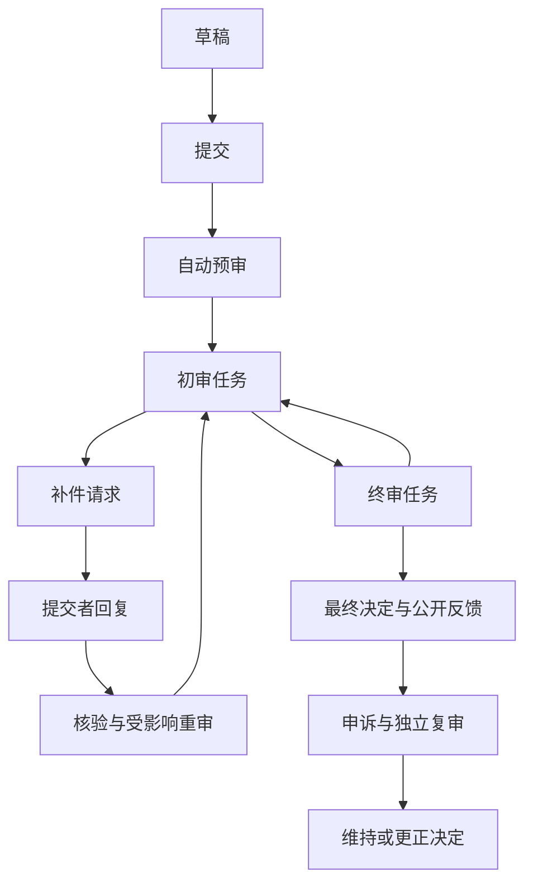

# 通用审核 Agent：用户闭环与易用性设计

日期：2026-10-04。本文定义待实现的用户行为、页面和状态，技术合同见 [07](07-application-and-execution-design.md)，交付顺序见 [05](05-completion-roadmap-and-feasibility.md)。完整范围沿用 [02](02-product-and-templates.md) 与 [04](04-acceptance-and-evaluation.md)。

## 1. 使用者与导航

审核区保留现有三栏，顶部增加“我的待办 / 案卷 / 批次 / 模板”。从列表进入单案时，三栏承担材料核对与结果处理；模板编排和批次组织使用独立页面，不把全部表单挤进三栏。

| 视图 | 默认关心的信息 | 默认可操作动作 |
| --- | --- | --- |
| 学生/提交者 | 当前材料是否齐全、需改什么、何时补交、最终反馈 | 填表、交材料、自查、回复补件、再提交、申诉、下载公开反馈 |
| 审核员 | 自己的待办、事实与证据是否一致、需不需要找学生 | 核对原件、纠错、确认问题/误报、提出补件、事项初审 |
| 老师/终审人 | 初审意见、分数明细、未解决范围、决定依据 | 复核、处理例外、终审、退回前级、生成反馈 |
| 评委 | 被分配项目、量表、截止时间、本人评分状态 | 阅读匿名材料、逐维度评分、公开反馈、内部意见、提交/回避 |
| 组织者 | 整批进度、缺评/分歧/同分、名单与交接 | 分案、排队、分配、替换回避评委、汇总、裁定名额、定稿/重开 |
| 模板负责人 | 规则表达是否完整、冲突、适用时间、测试表现 | 起草、确认规则、试跑、发布、复制、新版本、导入导出 |

本地安装可切换工作视图，并显示“本地身份”。系统按当前角色、任务、阶段校验业务动作；单机切换不宣称防止设备所有者读取本地数据。独立评委与提交者协作通过独立副本/离线包验证，未来真实身份从认证端口进入同一动作合同。

默认不展示开发术语、运行 hash、原始 JSON 或模型 token。技术诊断放在详情。页头用业务语言显示状态、待办数量、最后有效运行、当前模板/规则版本；有历史结果时可明确切换查看。

## 2. 第一次进入与创建

### 2.1 初始页面

提供“使用模板”“体验示例”“创建模板”三个入口。六个模板卡片说明适用对象、是否评分、审核级数和需要哪些材料。只有已发布且依赖齐全的版本可创建真实案卷；草案进入编排页。

示例使用明确虚构的政策和材料，显示“演示数据”；离线受控结果与真实模型运行区分标记。复制示例为真实案时先确认保留哪些材料/规则，不自动沿用模拟响应。加载示例失败显示重试与诊断，不回退到列表中的任意真实案卷。

首次创建真实案时复用全局渠道选择；已配置模型直接可选。没有模型仍可填写表单、登记/预览文件、执行已确认程序规则；需要模型的范围列为待执行，不能显示完成。

### 2.2 创建表单

选模板 → 根据模板生成对象表单 → 上传材料 → “开始审核”。综测才显示学年、学号和申报分；实验室申请显示组织、人数、时段与用途，不出现校园计分占位字段。

表单区分案卷基本信息和可重复事项。每个字段有可读名称、类型、枚举选项、单位、条件必填说明；0、false 和空值分别处理。重复事项支持新增、复制、删草稿；已进入审核的事项使用带理由的停用/更正，不抹除历史。

学校成绩/任务查询是可配置能力。缺接口时允许手填并标明来源，或按模板进入人工核验；不能自动补假成绩。模板负责人须明确哪些来源需要确认才能终审。

## 3. 单案三栏工作台

| 区域 | 默认内容 | 深入操作 |
| --- | --- | --- |
| 左：依据 | 启用依据、版本/适用期、规则分类、确认/冲突状态 | 原文、规则编辑草案、适用条件、优先关系/例外、政策历史 |
| 中：材料 | 材料清单与处理状态、事项列表、当前事项事实与证明 | 原件预览、字段纠错、拆并、证明绑定、替换/停用/重试 |
| 右：结果与待办 | 运行进度、必要待办、问题/计算明细、人工处理与阶段动作 | 覆盖账本、历史比较、决定理由、补件清单、报告 |

各栏提供搜索、按状态过滤、折叠和当前选中项。左栏支持按来源文件和规则类别找条款；中栏支持按事项/材料/页码；右栏默认先呈现阻止当前业务推进的待办，已处理问题可折叠，始终可查历史。

### 3.1 三类状态必须同时可见

1. **材料状态**：已登记、读取中、部分读取、读取失败、已读取；解析/OCR/图像识别分开说明。
2. **检查状态**：符合、不符合、待补件、待确认、不适用、未执行、执行失败。
3. **业务状态**：草稿、已提交、审核中、待补件、待复审、待评分、待终审、已决定、归档。

“Agent 执行结束”不等于“老师已批准”；“没有问题卡”不等于“全部检查符合”。显示完整符合时需附可展开的检查账本与材料范围。全部不适用显示“本次无适用检查”，不能显示经过审核的全符合。

### 3.2 一次开始与集中待办

普通入口只有“开始审核”。自动执行：登记/分类 → 读取与 OCR → 提取 → 绑定候选证明 → 规则检查/计算 → 核验引用 → 生成摘要。高级用户可重做指定步骤，原有“大纲/识别/审核”按钮移到高级动作中。

只有真正阻断的歧义要求用户回答，例如同名学生材料归属、两个冲突上限、证书等级不清。相同原因合并为一张待办，列出受影响事项和最小需要补充的信息。用户可以跳过并保留未知；其他独立检查继续。

进度显示阶段、文件/检查计数、正在处理的文件、等待原因和已保留结果。停止后不继续发请求或写业务决定；正在中止有独立状态。继续时复用可验证产物，输入已变化则创建关联新运行，用户看到哪些部分重新执行。

### 3.3 原件与问题联动

点击问题卡：中栏定位申报或证明原件，红/黄高亮；左栏定位相应依据原文，蓝色高亮。卡片可列多条依据、多份证据，各有文件名及精度，用户可逐条切换。

- PDF：真实页码、缩放/旋转后正确高亮；只有页级位置时只定位页并标明精度。
- 图片：原图与 OCR 字块对应；只有文件级证据时打开整张图，不制造矩形。
- 表格：切换 sheet，定位单元格/范围，保留原值与显示值。
- Word：定位真实结构段落/表格，并提供现有 Office 原件预览；没有可靠排版映射时不声称页级位置。
- PPT：定位幻灯片；精确文字块映射未建立时显示页级或文件级。

复用现有文件预览组件，增加审核导航适配。若预览器暂不支持某种精确跳转，显示结构化原文落点和原件打开入口；最终支持矩阵与 A03/A08 一致，不能将这个过渡方案当成所有格式精确预览完成。

窄屏仍以栏目标签切换。点问题自动打开目标材料，提供“查看依据”和“回到问题”按钮；记录原卡片与滚动位置。定位在目标加载完成后执行，避免高亮在隐藏栏目耗尽。键盘可选卡片、打开引用和返回。

## 4. 纠错、规则和材料修订

### 4.1 事实纠错

字段显示“AI 提取 / 人工确认 / 来源冲突 / 未知”和引用；点编辑可看原值、新值、单位、确认状态及更正理由。更正提交后保留原提取记录；重提取提出新候选，不覆盖已确认值。

拆分事项时选择字段和证明如何归属；合并事项时处理冲突值及重复证明；两者均先预览影响范围。AI 可建议拆并，用户确认后由应用命令执行。

### 4.2 证明绑定

事项显示“2 份候选 / 1 份已确认”而非永久静态的证明计数。绑定面板可从材料清单拖选或搜索，说明支持姓名、等级、日期、参与事实等哪个字段；支持一证多项、多证一项及明确的共享范围。

相同图片/证书重复上传与同一活动重复计分是两种检查，不能一看到重复文件就核减。归属歧义必须确认。拒绝候选绑定保留原因，后续提取不能重新静默确认同一候选。

### 4.3 文件替换、停用与重试

材料卡显示有效版本，可“替换为新版本”“停用”“重试读取”“查看历史”。替换默认让同一逻辑材料的旧版不再参与新审核；先询问是否属于另一份独立证明。原件保持不可变，同名文件按版本 ID 区分。

停用依据或材料前预览受影响的事实/检查；需要理由。读取失败重试不重复新增同一原件，解析修订增加，相关引用重新核验；重新上传不同字节才形成新文件版本。

### 4.4 多依据与规则确认

AI 起草规则时同时展示原文和结构化表达：适用范围、要求、输入字段、计算、例外、时间、未知时如何处理。负责人集中确认有业务影响的内容；自然语言条款不能因 AI 生成成功就自动变成已确认公式。

冲突提供并排条款、影响检查、优先依据/明确例外/保持待确认等选择。上传顺序不决定效力。新发布政策不自动改在审案或评审批次；用户可以复制案卷或显式升级，预览变化并重新审核。

负责人手填要求作为独立来源，记录录入人、时间和正文；报告显示“负责人要求”，不伪装为校规原文。

## 5. 人工处理、审批、补件与申诉

### 5.1 问题处理动作

每张问题卡可选择确认问题、误报、请求补件、适用例外/豁免、升级复核；需要解释的动作收集理由。处理记录与 AI 原结果并列，后续运行只标是否仍适用。

误报必须说明误在规则适用、事实还是语义判断；系统生成人工复核记录或字段/规则更正。豁免有授权与依据，结论显示“有条件处理/例外批准”，不能变成所有原检查天然符合。尚未处理和重新需要确认的卡片不能被隐藏成已完成。

### 5.2 业务流程

图展示两级模板，单级模板可在其唯一人工阶段形成最终决定。业务循环用新任务轮次表达，保留每次提交/退回；不删除前级决定。

| 动作 | 业务含义 | 状态及结果 |
| --- | --- | --- |
| 初审通过 | 当前审核阶段完成 | 创建下一阶段任务；尚有终审时不能直接已决定 |
| 事项通过/部分通过 | 对选中范围作阶段决定 | 其他事项继续；案卷是否可结束由模板要求计算 |
| 退回补件 | 指定可补正的缺口 | 创建关联补件请求，等待回复后核验 |
| 退回前级 | 要求前级修正审核 | 新建前级任务轮次，原意见保留 |
| 最终驳回 | 当前程序形成不批准决定 | 已决定，可按模板申诉；不自动待补件 |
| 撤回申请 | 提交者终止当前申请 | 记录撤回；是否允许重新发起由模板配置 |
| 终审通过/部分通过 | 最终阶段满足规定处理条件 | 冻结最终决定、事项清单/分值和公开反馈 |

每次决定必须显示作用范围、当前阶段、依据运行、尚未解决检查与最终分数。事实/政策改变后旧决定仍可查，但新终审必须核对最新范围；AI 不得替用户提交审批。

手工审核可补充某个程序未能执行的检查，须填写结果、实际依据和审核人；形成新的人工检查记录。未知、未读、豁免应按模板明确处理，不能通过“确认全部”直接抹去。纯人工模板也使用检查计划和手工运行记录，避免无模型时完全无法完成业务。

### 5.3 补件闭环

审核员勾选相关问题 → 合并补件清单 → 指定要素/材料槽、责任角色、期限、公开说明 → 发布请求。学生视图只显示公开问题及所需动作，不显示内部讨论。

回复可以上传新材料、选择已存在证明、填文字解释；每次回复独立保存。Agent 核对新增要素、生成满足/不足建议并重审受影响检查。审核员确认请求已满足、不足或取消；“已回复”始终不自动等于“已满足”。

一案有多个补件请求时，完成其中一项不解除其他等待。请求不足后允许继续回复，显示还缺什么；取消需理由。所有请求结束后才依据当前阶段恢复任务。

### 5.4 申诉与复审

学生在允许期限内选择某次公开决定、说明异议、提供证据；复审人看到原依据、原人工意见和新信息。支持维持原决定、更正原决定、撤回申诉；更正追加决定并关联原决定及复审任务。

现有 `Appeal.status` 的英文命名存在业务歧义。补完设计新增明确的复核结论 `maintain-original`（维持原决定）、`amend-original`（更正原决定）与 `withdrawn`（撤回）；旧 `upheld/overturned` 按历史操作和关联决定迁移，无法判明则待人工确认，不能凭英文直接反转结果。页面与离线包使用同一结论合同。

复审人独立性按模板要求配置，本地人员标来源；未来认证服务负责验证真实人员与组织范围。反馈明确哪些原决定仍有效、哪些已被更正。

## 6. 模板编排与六套内置业务

### 6.1 面向普通负责人的向导

按业务问题分六步，可随时保存草稿：

1. 审什么：对象类型、显示名称、单案/重复事项及字段。
2. 交什么：材料槽、格式、份数、条件必需、要素与共享方式。
3. 依据什么：上传政策或填写要求，确认规则和冲突。
4. 怎么判断/评分：条件、数值映射/合计、语义核对、人工量表或无评分。
5. 谁处理：阶段、角色、通过/退回路径、最低审核人数、期限、是否校方拥有流程。
6. 输出什么：学生/内部/组织者报告、补件与评分包，试跑后发布。

自然语言描述由 AI 起草这些配置，展示可读摘要与待确认项；负责人能够用表单编辑，无需操作 JSON。高级条件编辑器支持“全部/任一/否定”及字段比较，计算编辑器只提供实现了的算子。无法编译的表达转为语义或人工检查并说明，不能假装程序规则。

试跑页选择样例或自带材料，显示生成表单、适用检查、计算、流程和报告；草案不能进入真实批次。发布前校验所有字段/规则/政策/阶段引用、公式和来源，阻止缺依赖；警告要求确认。发布后修改通过新版本，导出包包含政策和必要来源资源但不含密钥。

### 6.2 六模板的最小完整业务内容

| 模板 | 核心字段/材料 | 完整路径 |
| --- | --- | --- |
| 综测 | 学生信息、类别/等级/日期/活动 ID、申报分；办法及证书 | 核对归属与等级 → 去重/择高/组上限 → 补证/核减 → 初审/终审 → 明细反馈 |
| 活动申请 | 组织、活动时间/地点/规模、计划与条件附件 | 资格/冲突/材料要素 → 修订计划/补件 → 审批 → 公开条件与结果 |
| 奖学金 | 申请类别、资格字段、成绩来源与证明 | 资格核验 → 缺成绩/证明待办 → 规定流程 → 入选/不入选及依据；名额由已确认规则处理 |
| 项目评审 | 项目、团队/匿名编号、申报书与量表 | 资格预审 → 独立评分/回避 → 汇总与分歧/同分 → 名额裁定 → 定稿反馈 |
| 报销 | 申请者、金额/币种/日期/预算行、票据和办法 | 明细核对 → 重复/限额/合计 → 补正 → 人工批准金额 → 明细报告 |
| 文件条款核对 | 文档对象、适用清单与版本、正文/附件 | 每条要求定位检查 → 缺失/冲突 → 修订草案/复核 → 人工结论与报告 |

以上是通用引擎的六份配置和样例，业务字段不得硬编码成六套页面。示例规则标明虚构；真实使用要求负责人成为对应政策的确认人，不把其他学校规则当本校现行规定。

## 7. 批次与评委

### 7.1 批次导入与处理

批次入口选择发布模板和锁定政策，导入表格、文件夹或 ZIP，先预览分案结果：外部编号/学号、字段映射、材料归属、重复行、未归属文件。识别冲突集中确认，不能仅凭姓名或文件名自动跨人绑定。

确认后生成每案独立记录及队列。表格显示当前阶段、材料/检查进度、阻断原因和负责人；可筛选、暂停/继续、重试失败案、打开三栏。单案坏文件不停止全批。批量动作先列明确选择范围和不符合动作条件的案，不暗中处理未审案。

批次内不能静默换模板/政策；升级需复制批次或显式重开并形成新评审轮次。历史批次和已定稿名单可查。

### 7.2 独立评分与汇总

组织者分配评委，设置最低有效人数、量表、条件 N/A、缺评策略、评分范围/精度、同分/名额规则。评委页只显示本人任务、材料和本人草稿；正式独立评分界面不预填 AI 分值，不显示其他评委评分。

提交校验每维度、范围、有限数、N/A 条件与理由，并冻结本次评分版本。改分需要重开授权与原因；补交/回避/替换都有独立记录。回避不充当零分或一次有效评分，分配数量也不等于有效人数。

汇总显示每维度实际分母、平均值、权重、N/A/缺评分布、有效人数和总分。模板明确原始量尺、是否转百分制及 N/A 重新归一策略；D11 示例按原始 1–5 加权得到 4.10，再按最高分 5 映射为 82.00，不能偷偷切换另一种归一方式。

达到人数且缺评分满足策略后才可定稿。分歧阈值触发组织者复核，原评分不被算法擦除。并列可共享排名、按指定维度比较或由组织者裁定；并列跨名额时按模板规定处理，未规定则等待裁定。最终排名/名额使用被冻结评分快照。

盲评需对输出材料、文件名、表单、引用和元数据都执行匿名化。只有隐藏页面姓名不算盲评；不可可靠脱敏的原件进入组织者处理待办，不能原样塞进匿名评分包。

### 7.3 没有多人平台时

组织者导出每位评委专属评分包，包含 assignment、锁定版本、必要材料和匿名化后的来源。评委在独立工作副本填写，导出回复包；组织者预览差异后导入。包中不含其他评分、无关案或模板密钥。

包可以重试导入而不重复计票；错 assignment、旧量表、旧材料版本或评分已定稿进入冲突处理。校方接入后同一评分命令由认证主体提交；本地手填评委名仍显示本地来源。

## 8. 快捷助手与输出

助手保留快捷键唤起，并有显式入口；关闭时不丢对话。线程按案卷/事项/运行绑定，可以查历史，引用标明对应版本。

快捷提问包括“为什么被核减”“还缺什么”“如何改这项”“比较两版”。答案引用可点到原文；原文缺失或截断明确显示范围。生成修改草案时列旧值→新值、理由、出处和影响检查，用户勾选应用；版本冲突重新预览。审批、评分和校方提交不作为自动应用草案动作。

Word/PDF 原件通常不可直接结构化回写；支持字段/规则/说明修改和导出建议稿，不声称直接修改已签章原件。具有可靠编辑能力的格式另以已实现能力展示。

报告选择受众、当前/历史运行及保存位置。至少提供学生公开反馈、内部审核报告、计分明细/批次名单、评委矩阵、机器 JSON 和离线交接包。MD/PDF/XLSX 根据用途提供，不要求每种报告都复制同一版式。

报告包含对象、模板/政策/材料版本、覆盖与未执行范围、事实/出处、规则计算、人工处理、阶段/最终决定、补件/复审历史及来源。历史报告读取历史快照，不混入新标题、新政策或后来决定。成功后显示路径与打开入口，取消/失败如实反馈。

学生版和评委包由服务端投影过滤内部内容；未知字段默认内部可见。内部意见、其他评委值、匿名映射和敏感诊断不能仅靠 UI 隐藏。

## 9. 用户验收脚本

以下须用真实页面和文件操作，并检查落盘/重启；固定模型用于可复现操作验证，真实模型正确性另测。

| 脚本 | 行为 | 完成观察 |
| --- | --- | --- |
| U01 普通新案 | 选综测、12 张图+文本证明，一次开始 | 所有材料有状态，必要歧义一次集中，问题能回到真实原件 |
| U02 识别错了 | 把等级/日期改正、填 0、拆分条目、改绑定 | 原值与理由保留；已确认值不被下一次提取覆盖；影响范围重审 |
| U03 补件到终审 | 部分通过，缺证项补模糊图再补清晰图，初审/终审 | 第一次已回复但不足，第二次满足；其他请求仍阻断；有公开最终反馈 |
| U04 误报和拒绝 | 标误报、适用例外、最终驳回、退回再交 | 各类业务含义和状态正确，驳回不自动待补，历史不被抹掉 |
| U05 申诉 | 新证据申诉，另一复审人维持/更正 | 关联原决定，追加复审决定，学生看清有效结论 |
| U06 全符合/失败 | 完整符合、空发现但未执行、扫描失败、缺模型 | 四种状态可分辨；失败不显示全部符合，无模拟污染 |
| U07 小屏/长材料 | 点多出处卡，切文件/页/sheet，回问题，搜索 | 精度真实、键盘可操作、回到原卡、不跳错文件 |
| U08 通用配置 | 负责人无代码配置实验室组织申请 | 表单、无评分检查、补件、两级流程和报告完整，源码不改 |
| U09 批次与评委 | 分案、坏文件、独立包、回避/缺评/N/A、同分/名额 | 无串案；正确分母；缺条件不能定稿；定稿后变更需重开 |
| U10 中止/恢复 | 运行中切案、停止、关应用、重开、修改材料后继续 | 不串案、不永久 running、不重复业务动作；旧结果版本清楚 |
| U11 助手/报告 | 点引用、审阅草案、冲突、导出历史/学生/内部版 | 引用可点、确认后才改、报告不混版不泄漏、保存反馈真实 |
| U12 离线往返 | 独立学生副本回复补件，独立评委评分，重复/旧包导入 | 真正往返，身份来源清楚，去重/冲突有效，原案数据保留 |

U 类是操作脚本，不能替代 04 的 A/C/S 门槛。产品完整意味着普通用户能处理失败与纠错路径；假设知道方法，也仍需让操作结果和下一步清楚可见。
