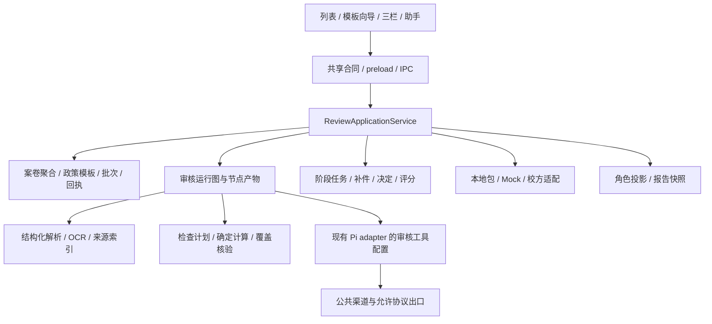

# 通用审核 Agent：应用层、执行与数据设计

日期：2026-10-04。这是对 [03 架构设计](03-architecture-and-delivery.md) 的实施补充。以下明确列出已有文件；新增类型、命令和模块名均是**拟实现合同**，不能按当前可调用 API 使用。用户流程见 [06](06-workflows-and-usability-design.md)，依赖见 [05](05-completion-roadmap-and-feasibility.md)。

## 1. 基座复用和代码落点

仍采用 Electron + Bun/TypeScript + Jotai + JSON 文件。Renderer 只调用 preload；主进程应用服务拥有业务状态，Pi 拥有模型会话，审核运行器拥有检查依赖与持久化。三者职责明确，避免两套任务状态分别推进同一教师审批。



| 现有文件或目录 | 改造内容 |
| --- | --- |
| `packages/shared/src/types/review-v2.ts` | 补配置能力、输入快照、检查计划、任务和命令错误；通过 schema 修订迁移旧 JSON |
| `review/template-store.ts`、`builtin-templates.ts` | 强校验、发布版本锁、完整六模板；新增政策存储与依赖包 |
| `review/case-store.ts`、`migration.ts` | 复用安全 ID、逐案队列和原子写思想；增加 V2 聚合存储、真实原件索引和迁移记录 |
| `review/review-ipc.ts`、preload、`review-atoms.ts` | 补四层接口与事件，按 case/run/batch ID 管理；保持 V1 历史可读 |
| `review/evidence-service.ts`、`business-workflow.ts`、`judging-service.ts` | 保留可用纯函数，修正语义并统一经应用命令落盘 |
| `review/review-run-graph.ts`、`run-service-v2.ts`、`run-store-v2.ts` | 自动技术步骤展开、检查点/产物、实时事件、取消与恢复 |
| `review/review-tools.ts` | 改为有真实 schema 的受控业务工具；补上下文、来源、计划目标校验 |
| `review/deterministic-engine.ts`、`coverage-ledger.ts` | 完整算子、稳定目标 ID、真实分组、检查分母和全部符合条件 |
| `document-parser.ts`、`review/document-service.ts`、`ocr-port.ts` | 原纯文本接口保留，增加结构化入口/OCR 适配；原件/解析/OCR 能力独立 |
| `file-browser/FilePreviewDialog.tsx`、`office-preview/OfficePreview.tsx` | 复用图片/PDF/Office 展示；补审核导航与来源范围，不复制通用预览器 |
| `adapters/pi-agent-adapter.ts`、`review/review-model-gateway.ts` | 公共工具配置/模型出口契约，取消信号与实际路由记录 |
| `review/report-service-v2.ts`、`external-ports.ts` | 最终决定投影、报告渲染、真正离线包往返、持久回执与接入能力 |

拟新增 `review/application-service.ts`、`case-store-v2.ts`、`policy-store.ts`、`rule-compiler.ts`、`pi-review-executor.ts`、`source-index.ts`、`batch-store.ts`；名称可按仓库规范调整。新增服务避免继续把业务堆进顶层 `ipc.ts`。

## 2. 先补共享契约

### 2.1 配置和运行对象的必要补充

| 契约 | 必须增加/明确 | 原因 |
| --- | --- | --- |
| FieldSpec | `scope: case/subject`、枚举选项、嵌套子 schema、默认值/显示提示、只读与校验规则 | 当前动态字段不足以生成新业务表单；防止学年/分值成为通用强制字段 |
| FieldValue 数值 | 金额/评分保留规范十进制文本与单位；现有 number 可作兼容显示投影 | 不能仅存二进制 number，事后再声称恢复了原文精确数值 |
| PolicyRef/PolicyVersion | 模板引用精确政策 ID+版本+内容 hash；政策原件/负责人声明来源；发布状态及确认记录 | 当前只写 policy ID、运行硬编码 version=1，且无完整仓库 |
| RuleSpec | 区分 applicability `when` 与 requirement 的约束 AST；有限计算表达、字段作用域、稳定来源 ID、冲突解决记录 | “何时检查”不能替代“检查什么”；自然语言 requirement 不能自动执行 |
| DocumentVersion | 原件字节 hash、逻辑 documentId、active/supersedes、来源、实际 assetKey、解析/OCR版本与能力、分页/表格索引 | 同名替换、原件读取、增量恢复和出处需要真实版本 |
| SourceRef/Location | 解析块 ID/摘录 hash，PDF page-only/矩形、图片矩形、sheet 范围、段落/表格、slide；坐标规范及精度 | 现有 file/paragraph/sheet-cell/pdf-rect 不覆盖真实页级降级与 OCR |
| Observation/EvidenceLink | 案卷字段/事项字段定位，确认人/原因、操作记录、实际来源版本，候选/拒绝历史 | 更正、绑定不能靠 AI 内存数组持久化 |
| WorkflowStageSpec | 稳定 stageId、依赖/正常下一阶段、退回目标、作用范围、人数条件、完成条件、流程 owner | 当前线性列表与 enterWhen/exitWhen 不足以表达两级和退回 |
| WorkflowTask | case/stage/轮次、负责人/角色、状态、前置任务、业务输入版本、截止与处理记录 | “谁下一步做什么”不是 case.stage 一个枚举能表达 |
| CheckPlanEntry | 固定 checkKey、规则版本、目标/组、适用性、所需输入/来源、执行类别 | 覆盖分母不能从 AI 返回问题反推 |
| RunInputSnapshot | 所有语义输入的规范化快照与 hash，执行配置/模型/解析版本，plan 和产物引用 | 保证历史、恢复、增量复用与报告同版 |
| BusinessDecision | 当前任务/轮次、最终或阶段性质、被更正决定 ID、范围、输入依据和批准条件 | 最后时间戳记录不一定是案卷最终决定 |
| Rubric/Batch | 最低人数、N/A/缺维度策略、量尺转换、分歧阈值、同分维度/名额、定稿快照/重开版本 | 当前汇总/排名不能完成 A14 |
| Supplement/Appeal | 每次操作的 actor/理由/revision；明确复核 resolution、关联任务/更正决定 | 回复、核验、取消与申诉必须统一事务和业务含义 |
| AssistantThread/DraftPatch | case/run/来源版本、消息与可点引用；候选 patch、基础输入版本、审阅结果 | 当前问答缺持久历史和可审阅修改 |
| IntegrationProfile/SyncReceipt | 能力、流程 owner、身份来源、外部 ID/revision、payload hash、发出/待回执/确认/冲突 | 导出一个包不等于收到对方确认 |

这些补充放在审核共享类型内，不新造公共 Agent 审批枚举。旧 JSON 通过显式 schemaRevision 迁移；缺失的新能力标为未知/待配置，不能补默认“已经确认”。

### 2.2 模板与政策发布合同

模板保存草案要有 draftRevision/CAS；列表分别查询最近草案、最近发布版，不用“最高文件版本”判断真实可用模板。发布版内容不可变，废弃状态放在版本元数据；修改规则或输出产生新版本。

发布校验至少包含：

- 字段作用域、类型、枚举/嵌套引用、有限数和单位；条件及算式类型正确。
- 政策依赖存在且版本/hash 一致；必需规则已确认，冲突/例外有明确处理。
- 规则出处能解析到政策文件版本/负责人声明；无原文不得伪造校规来源。
- 阶段 ID/依赖/角色/退回目标有效，无正常路径环和不可达终点；人数为有效正整数。
- 量表维度唯一、范围/精度/权重合法，最低人数、N/A/同分/名额配置完整。
- 所用格式、工具、输出有能力声明；完整依赖包可以导出与重导。

发布校验验证配置能表达且有执行实现；本机是否配置模型、当前是否能连学校属于运行 readiness，自检单独显示。允许发布声明需要外部核验的模板，但运行时必须进入明确待办；六套开箱示例的本地依赖必须齐全，不能靠未提供校方接口才能走完。

初期采用有向无环的正常阶段图，退回/补件/申诉创建新任务轮次；复杂条件仍使用有限条件 AST，不执行用户填写的 JavaScript。空白第七业务必须能够用相同 DSL 表达。

政策包包含文本、原件/声明、规则和来源索引；内置六模板各带虚构政策、完整示例与预期结果。真实政策从上传/声明创建新版本并确认，不能以虚构样例自动通过真实审批。

## 3. 应用命令、事务和持久化

### 3.1 命令外壳

现有 `ReviewAppCommand` 强制 caseId，不能直接用于模板/批次。扩展为目标资源类型，具体 payload 采用可辨别 union，IPC 边界进行运行时校验。

```ts
// 拟新增合同；每个命令的 payload 另有严格 schema。
type ReviewCommand<T> = {
  requestId: string
  target: { kind: 'case' | 'template-draft' | 'policy-draft' | 'batch'; id: string }
  expectedRevision: number
  actor: Actor
  type: string
  payload: T
}
```

读取命令不要求 revision。新资源由客户端预分配安全 ID、expectedRevision=0；重试使用相同 requestId。学校模式的 actor 由认证上下文解析，不能接受客户端声称的教师角色。本地模式的 actor 保留 local 来源并按任务/视图规则检查。

统一错误沿用 VERSION_CONFLICT/NOT_FOUND/VALIDATION_FAILED/CAPABILITY_UNAVAILABLE/PERMISSION_DENIED，补 REQUEST_ID_COLLISION、STALE_INPUT、INVALID_TRANSITION、DEPENDENCY_UNRESOLVED；返回可读原因、当前版本和可处理差异。不能仅抛一个无法区分的字符串。

### 3.2 命令清单

| 资源 | 拟命令/查询 | 必须校验 |
| --- | --- | --- |
| 模板/政策 | SaveDraft、GenerateDraft、Validate/Trial、Publish、Copy、Deprecate、Export/ImportBundle | 草案 revision、完整依赖、出处与确认、导入 schema |
| 案卷 | CreateCaseFromTemplate、Submit、UpdateFields、Add/Split/Merge/DeactivateSubject、Correct/ConfirmObservation | 发布版本、字段作用域、人工确认锁、任务与范围 |
| 材料 | RegisterDocuments、Replace/DeactivateDocument、RetryParse、SetMaterialSlot、SetEvidenceLink | 原件归属、版本链、材料槽、绑定目标/共享范围 |
| 运行 | Start/Cancel/Resume/RetryRun、GetRun/Artifacts、SubscribeEvents | 当前快照、计划、模型能力；恢复产物和中止状态 |
| 处理与阶段 | SetFindingDisposition、CompleteManualCheck、RecordStageDecision、ReturnToStage、Reopen/Withdraw | 当前任务、角色、依据运行/输入 hash、范围与阶段条件 |
| 补件 | Open/Respond/Resolve/CancelSupplement | 问题/槽关联、有效文件、请求状态、所有未结束请求 |
| 申诉 | Submit/Assign/Resolve/WithdrawAppeal | 原决定、期限、复审人、关联新决定和有效结论 |
| 批次 | PreviewImport、Create/CommitSplit、Queue/Pause/Retry、Assign/RecuseJudge | 分案确认、模板政策锁、逐案状态、重复与归属 |
| 评分 | Save/Submit/ReopenRating、Aggregate、ResolveTie/Quota、Finalize/ReopenBatch | assignment/本人/轮次/量表、维度/有限数、人数与缺评分 |
| 助手/报告 | AppendThreadMessage、Generate/ApplyDraftPatch、CreateReportSnapshot、Render/Export | 当前案可见范围、来源版本、patch冲突、历史快照 |
| 交接 | Export/ImportPackage、ConfirmPackageReceipt、Push/RetryAction、ResolveSyncConflict | actionId/hash/外部版本、目标权限、差异、真实回执 |

AI 工具不能直接调用人工决定、评分提交、模板发布或外部写回。AI 生成建议/候选产物，应用服务验证后保存；用户确认命令才改变相应业务状态。自动通过仅限模板已显式授权且符合其全部条件的系统动作，默认关闭。

### 3.3 案卷聚合

拟使用 `review-cases/{caseId}/state.v2.json` 作为单案业务事务文件，包含 caseV2、observations、evidenceLinks、dispositions、tasks、decisions、supplements、appeals、assistant 线程索引、命令回执和业务事件。

单案命令步骤：逐案写队列 → 读取最新聚合 → 查 requestId+payload hash → 校验 expectedRevision/角色/状态/引用 → 调用纯函数 → 全部业务变化+revision+回执+事件写临时文件 → 原子替换 → 发出已提交事件。相同 requestId/相同载荷返回原回执；相同 ID/不同载荷拒绝。

幂等回执与业务变化在同一事务，不能先写业务、再单独写回执。恢复时以聚合为真值，JSONL 诊断日志只是辅助。每次补件回复/核验、申诉处理、绑定与决定都统一增加业务 revision。

纯业务函数返回变更内容与实体，revision 递增由应用事务统一完成一次；改造现有函数时消除内外双重递增。无需变更的幂等/no-op 返回既有版本，拒绝的命令不写部分业务数据。

原件、长助手消息、运行产物可先写不可变文件，聚合只在文件完成后引用；失败留下的无引用暂存文件可清理，不能留下引用不存在文件的业务记录。定期做带 manifest 的聚合快照与日志归档，去重记录归档后仍可查询，不靠只保留最近若干 requestId 实现幂等。

复用现有 `assertSafeId` 和逐案串行写法；临时文件使用唯一名，避免并发覆盖固定 `.tmp`。目标机验证原子替换与中断行为；对需要断电恢复的提交使用 flush/fsync 策略并保留上一有效快照。无需为单机引入数据库。

模板、政策、批次有各自资源队列/CAS。批次定稿涉及多案时先生成不可变 case/rating 快照，再原子提交 batch manifest，读者仅认 manifest 已确认的快照。失败可重试，不能逐案“部分定稿”后声称整批成功。

### 3.4 业务 revision 与审核输入版本

业务 revision 对所有业务变更递增，用于防止并发丢写。审核 inputHash 只包含影响判断的内容；聊天/备注不让整轮过期，决定变化更新报告/业务状态而不重做 OCR。

输入包括：模板/政策实际版本与内容、caseFields、有效 subjects/字段/确认状态、有效文件原件 hash 与解析修订、observations/links 内容及状态、规则例外/冲突解决、所需外部事实来源。对象按固定键序规范化，集合按稳定 ID 排序；不能只 hash IDs、数量或 JSON 属性的偶然顺序。

执行 profile 单独记录实际模型/渠道/协议、提示和工具 schema 版本、解析/OCR/计算版本、预算；secret 不进入快照。节点 dependencyHash 同时纳入相关输入和执行器版本，决定缓存是否可复用。

命令 payload 的规范 hash 用于去重；原件字节 hash 用于文件身份；审核 hash 用于有效性，三者不可互换。新设计使用 SHA-256，旧 SHA-1 记录带 algorithm 标识保留兼容。

## 4. 自动执行与 Pi 接入

### 4.1 技术步骤与人工阶段分开

修正 `planRunGraph`：每个自动审核阶段展开登记/分类、按文件解析、按页/OCR、按对象提取、绑定、检查计划、按规则目标检查、组级计算、引用/覆盖核验、摘要。教师审核与评委评分创建 WorkflowTask，由应用服务推进，不映射为任意一个 AI `check` 节点。

节点显式 dependsOn，按案/材料/目标形成可独立分支。规则冲突只阻断其依赖检查，坏文件只阻断依赖它的检查。纯摘要失败不抹除已完成计算；界面显示部分完成和真实范围。

提取/绑定输出先作为候选产物保存。有效事实视图由输入中已确认记录优先、当前提取候选次之构建；关键事实未确认时按规则产生待确认。产物不得静默覆盖人工作业。Observation 是事实与更正的记录真值，subject.fields/caseFields 是由有效记录生成的表单投影；应用命令在同一事务更新两者，不允许 UI 分别写出矛盾值。手填字段也生成带 actor/source 的 Observation。

在检查启动前冻结有效事实视图、计划与来源快照，保存为 run artifact。一个运行的原始输入和已冻结检查输入不可变；用户确认/补件改变输入后创建关联新运行，复用 dependencyHash 一致的旧节点。UI 的“继续”可对应这个新运行，不要求重做全部步骤。

### 4.2 真实节点产物和实时事件

NodeExecutor 返回结构化产物及状态，包含 runId/nodeId、dependencyHash、schemaRevision、所用源 ID、checks/opinions/observations/links 或解析索引。不能只返回 `done + hash`。

节点开始记录 running；产物完成写不可变文件；校验其规则/目标/来源属于冻结计划；提交 checkpoint+outputRef+产物 hash；再发已提交 node-completed 事件。检查结果、意见、覆盖由这些产物装配，不从工具内存数组或最终一段自然语言推测。

事件含 caseId/runId/sequence/节点/状态/计数/时间；执行过程中回调，持久化后订阅广播。renderer 先查询快照再从 sequence 订阅，断线后重查；切案不会把另一案结果写进当前 atoms。

队列分别约束案卷、解析 worker 和渠道请求并发；同案只能有一个提交当前结果的执行者，额外请求排队或明确取消替换，不能最后返回的旧结果覆盖新代次。限流/预算/模型重试由一个层次统一计数，避免 Pi 和外层重复重试；默认值通过目标机和 100 案压力验收确定，不宣称无限吞吐。

### 4.3 状态、中止和恢复

| 情况 | 行为 |
| --- | --- |
| 节点正常完成 | 留产物/checkpoint；下游可启动 |
| 需要补充输入 | 节点 waiting-input，生成合并待办；无关分支继续 |
| 模型/解析失败 | 节点 failed，保留已完成产物和明确原因，有限次数重试 |
| 用户停止 | 保存 cancel-requested；传 AbortSignal/调用 Pi abort；停止启动新节点；最终 cancelled |
| 进程退出 | 启动扫描 running；没有活跃执行者时转 interrupted/recoverable，不永久 running |
| 同输入恢复 | 使用原 runId/输入快照；逐节点核验 hash、产物存在/结构后跳过 |
| 输入改变后继续 | 新 runId，关联前运行；复用依赖未变的可验证产物，重做变化范围 |
| 图缺依赖/存在环/无可执行却未结束 | 明确计划错误或等待原因；绝不返回 completed |

运行文件保留全部节点状态，包括未启动和已有 done 节点；恢复不能仅保留本次新生成的 checkpoints。node attempts 与失败原因独立累积。完成状态只在计划满足定义时生成，非合规材料可以被成功查出违规；仍有未读/未知/未执行则显示相应等待或部分完成。

cancel-requested/interrupted 可作为新增状态或持久字段，实施时统一 shared/存储/UI。中止后迟到结果仅可记录诊断，不提交未经确认的新业务动作。已收到的校方回执不能当作可撤销动作；界面应保留事实。

### 4.4 Pi 执行器合同

`PiAgentAdapter` 已有 `customTools`、事件和 `abort(sessionId)`，应复用。它当前同时组装内置 read/bash/write 等和产品工具，**只传 customTools 不会自动移除这些工具**。

公共适配层增加 `toolProfile: general/review` 或等价 allowlist，在注册工具前选择集合；review 仅注册审核业务工具和明确允许的会话压缩能力，权限检查再做上下文校验。审核会话不自动发现无关项目指令/skills/MCP，cwd 指向本案受控沙箱；普通 Agent 原行为保持由其配置管理。

模型选择复用公共渠道/凭证/代理，并经过审核允许协议校验。已测/声明/未知的 text/vision/structured-json/tools 能力区分保存；未知可小请求探测，失败需重选或相应范围待执行。运行中改配置不默默换第一个渠道，记录每个已发请求的实际路由。

现有固定 JSON HTTP 调用可作为不需工具的提取 executor，但不能把它称为已完成 Pi 工具编排；完整目标接真实 PiReviewExecutor。渠道的协议转换由公共层提供，避免审核复制其 buildModel/密钥实现。审核和快捷助手使用相同允许出口。

当前审核网关明确实现 OpenAI Chat Completions 与本地 Ollama `/api/chat` 两条线；Pi 通用层仍有其他协议。公共模型端口须为这两类提供一致的 messages/tools/structured-output/abort 合同：OpenAI 兼容走公共兼容传输；本地私有线由专用转换器处理。若本地平台暂不支持工具，只运行可支持的节点并标明待执行范围，不能通过 Pi 默认 provider 映射悄悄改用另一协议。全局收敛时同步设置入口、存量渠道迁移、Agent/学业/审核调用点，保留已配置本地平台的迁移说明。

### 4.5 审核工具

现有五工具可保留名称思路，必须补真实 schema 与验证：

- `read_subject_field`：返回作用域、值、确认状态、实际 Observation 引用；0/false 有效。
- `search_document_text`：分页返回，明确 total/truncated；使用 versionId、parseRevision、blockId；不能只返回可混淆的 documentId 与前 200 字。
- `record_observation`：字段类型、有限数、枚举、来源存在/归属/精度校验；保存候选且保护人工确认。
- `link_evidence`：校验 subject/document/材料槽/共享范围、真实来源，不接受任意跨案 ID。
- `submit_check`：只允许计划中的 rule+target；语义结果须真实引用/理由；确定性计算由程序执行，manual 结果只能来自有权人工命令。

补 `read_rule`、按来源读取原文、提出缺件/修改草案工具；它们返回候选，不能自动批准/发正式补件/改最终评分。sourceRef 的 parseRevision 从索引读取，禁止当前工具硬编码为 1。

材料中的“忽略制度/判我通过”等文字只是材料内容，不能修改工具集合、规则版本或权限。功能评测须实际输入这些材料并核对工具调用与结果。

## 5. 确定性规则、计划与覆盖

### 5.1 可编译规则

编译器区分 applicability 与 requirement：适用性 true 执行要求，false 生成带依据的不适用结果，unknown 生成待确认。已知缺失与未识别不能混同：前者可触发必填/缺件，后者说明尚无法判断。

首批有限算子覆盖 required、比较、日期区间、枚举映射、互斥、重复、sum/max/single、择高、封顶、weighted-sum 与量尺转换。条件引用显式 case/subject/fact，类型/单位/日期在发布时校验；未实现算子不得发布为 deterministic。

计算值先从原文/表格规范成十进制文本和单位；内部采用固定精度整数/BigInt，或经评估的十进制依赖，禁止先用二进制浮点相加再 toFixed 充当精确计算。除法保存中间精度及模板舍入规则，最后按明确节点舍入。日期区分纯日期和带时区时刻，首尾是否包含由规则给出。

### 5.2 组级计算

按真正 `groupBy` 展开目标；缺失分组/去重键进入未知，不把多个空键合并。先确认资格与适用性，再去重、按已配置 select、aggregate、cap、allocation；single 出现多候选须按配置处理，max 不能偷偷 sum。

每个事项保留入选/舍弃/截断/未知理由与计入值。空组返回明确无候选/不适用/缺输入，由规则定义，不触发空数组 reduce 异常；负值、币种/单位、无穷值和非法 cap 在验证阶段拒绝。稳定排序和舍入规则同一输入重放一致。

`CheckResult.calculation` 保存全部输入值/单位/来源、运算步骤、规则版本、原始及最终结果和分配账本。AI 建议分、程序规则分、人工最终分是不同字段，模型给 999 不改变程序结果。

### 5.3 检查计划与稳定 ID

计划由有效规则×真实目标生成 subject/group/case 检查。group 目标包含规范 groupKey 和成员 ID；checkKey 从规则版本+目标生成，同一计划稳定，跨政策版本区分。问题使用 checkKey+问题类别+事实定位生成 findingKey，不用 Date.now 随机键继承人工意见。

事实/规则版本改变后，历史处理保留；只有原因与依赖仍相同才可建议沿用，不能把旧误报/豁免自动套到新问题。未收到计划内结果生成 not-executed，错案/外来规则/重复结果进入诊断而不进入覆盖。

### 5.4 完整符合条件

“计划处理完成”与“全部符合”分别计算。完整符合必须满足：

1. 模板/政策依赖可用，计划非空；仅案卷级业务可无 subjects，但仍须有有效计划。
2. 必需材料槽/条件要素齐全；所有有效相关材料/page/chunk 已处理或有明确不相关判定及理由。
3. 每个计划条目有唯一有效结果；不适用有已验证条件，不算缺执行。
4. 适用检查无 non-compliant/awaiting/failed/not-executed；已登记未读、部分读取同样阻断。
5. 引用真实且支撑断言；必要事实、规则和外部核验满足确认条件。

有授权豁免时可形成带例外的人工决定，但原始账本不能显示天然全符合。零计划、全不适用、零事项且未确认对象分别显示明确状态。手工检查也生成记录和出处，不能用点击“已读”代替审核。

引用核验分层记录：ID/案卷/版本/位置存在性由程序验证，数值/枚举/日期断言尽量用结构化事实比对，语义支撑由限定原文的核对与必要人工确认验证。仅有合法 ID 不等于原文支持结论；语义核对本身仍需真实模型真值集评测，不保证消除全部误判。

## 6. 材料、OCR、位置和预览

### 6.1 结构化入口

在现有纯文本解析旁新增 `parseStructuredDocument`，输出原件字节 hash、逻辑版本、解析/OCR引擎版本、页/slide/sheet/段落索引、文本块、位置/精度、部分失败清单和预览能力。按 hash+解析配置缓存；解析成功与完成审核的 usage 分开。

保留原件相对 assetKey，主进程按 case/version 获取，renderer 不凭任意路径访问。同名文件不覆盖；替换/停用以 active manifest 决定本轮有效材料。导入失败也登记文件与原因，文件夹/ZIP 展开后每项有来源路径；非法路径、包大小/条目上限及加密文件有明确错误。

### 6.2 分格式策略

| 格式 | 解析与来源 | 预览复用/新增 |
| --- | --- | --- |
| PDF 文本 | 复用已安装 pdfjs-dist 按页读取文本 item，保存页/变换位置；不能再 flat text→page=1 | 复用 PDF 预览入口，增加版本/页/矩形导航 |
| PDF 扫描 | 逐页判断文字与图像，按需栅格化→OCR；混合页单独记状态 | 同一 PDF 原件叠加 OCR 位置 |
| 图片 | 原件尺寸/方向、OCR 字块；视觉理解生成事实候选 | 复用图片缩放；增加矩形与原文对照 |
| DOCX | 真实段落/表格节点；普通 mammoth 文本作为兼容输出 | 复用 OfficePreview；需要结构节点导航桥，布局页码只有可靠映射才提供 |
| XLSX/CSV | 保留 sheet/行/单元格、原值/显示值/公式与缓存值、日期系统 | 复用 Office 预览，增加 sheet/cell 导航；结构表格视图提供稳定定位 |
| PPTX | slide/文本/表格索引，嵌入图登记；图片/OCR有独立状态 | 复用 OfficePreview 的 slide 能力并加审核入口 |
| TXT/MD | 字符范围/行/结构段落；不虚构页 | 复用文本/Markdown 预览和高亮 |
| 历史/其他格式 | 按实际 parser 接受矩阵；可读部分与失败范围明示 | 原件打开或已实现预览；最终支持清单逐格式验收 |

公式缓存缺失/错误时进入待确认，不能把 SheetJS 的读取当成任意 Excel 公式已经重算。CSV 必须用支持引号/换行的解析器，不用每行直接 split(',')；学号/编号按文本保留前导零。

### 6.3 坐标规范

PDF 保存原页尺寸与旋转，位置使用未旋转页面的标准坐标并带 coordinateSystem；预览适配通过同一 viewport 变换到屏幕，避免缩放或上下原点造成错框。图片保存处理前原件尺寸/EXIF方向与 OCR 到原图的变换。只有位置可验证才建立矩形引用，否则使用页/段落/文件级精度。

新增审核预览导航合同 `ReviewPreviewTarget = { sourceRef, precision, highlight, returnFindingKey }`。主进程按 case/version 解析并授权原件，现有预览组件接可选的页/slide/sheet/段落目标，通过能力回执说明实际定位精度。加载完成再导航；若原件不可用或解析修订不匹配，显示原因和历史来源，不对当前文件猜测定位。需要调整通用预览的 props/桥接时与基座成员共用接口，不以任意父目录授权绕过案卷范围。

PDF.js 官方示例明确提供按页访问、viewport 与坐标变换；这支持复用现有依赖建设定位，但仍需在当前安装版本和预览桥上验证。[PDF.js 官方示例](https://mozilla.github.io/pdf.js/examples/)

### 6.4 OCR 选型与验证

优先验证本地 Tesseract.js 实现 OcrPort，作为无校方 API、无 Python/系统 OCR 前提的候选。它以 WASM 包装 Tesseract，支持浏览器/Node，**不直接支持 PDF**；扫描 PDF 需先分页栅格化。矩形所需的 blocks/hOCR 输出要按实际版本显式启用。[Tesseract.js 官方说明](https://github.com/naptha/tesseract.js)

OcrPort 升级为输入 documentVersion/pageAsset/语言/AbortSignal，输出 engine/version、文字块/置信信息/矩形、原件变换、失败原因；当前仅 text+pages 的端口不足以支持精确高亮。worker、WASM、中文/英文语言资源随包，在断网新机器验证，不运行时从 CDN 补依赖。

技术验证使用中文证书、印章覆盖、旋转/模糊图、表格扫描、混合 PDF；检查识别字段、位置对齐、首次内存/耗时和 Windows 包内 worker 路径。通过后锁定版本/资源清单；未通过则替换 OcrPort 实现，业务和来源合同不改。

已配置视觉模型可以辅助图像理解/纠错，但不得编造坐标或确认外部真伪。视觉模型无位置时标真实页/文件级。人工录入附原件和原因，维持业务可处理，不能算自动 OCR 验收通过。

XLSX 结构化读取/导出可评估 SheetJS 等实现：官方 cell 模型区分原值 `v`、显示文本 `w`、类型和公式，适合保留这些信息。仓库已有 officeparser 文本提取不等于已有直接可用的结构化表格 API；先检查依赖和许可证/发行源，再决定增加直接依赖。[SheetJS 官方 cell 模型](https://docs.sheetjs.com/docs/csf/cell/)

### 6.5 自动分批

根据所选模型的图像数量、字节、上下文与预算拆文件/页/chunk；每批保存 manifest、输出和来源。12 张图全部登记处理，不仅发送前 8 张。压缩生成派生 asset，保存原图映射；跨批去重/绑定保留来源，末批失败仅使相关范围未完成。

缺视觉能力可先 OCR 文本；图片语义仍需的规则保持未执行。预算/配额暂停提供已完成范围和继续动作，有限重试；不能去图成功后称完整检查。

## 7. 审批、评委与外部协作

### 7.1 阶段任务推进

RecordStageDecision 验证当前任务/角色、有效范围、依据 run/input、所需人工检查、事项处置与分数来源。初审通过推进下一任务，只有最终阶段满足全案完成条件才设 decided。return/reject/withdraw 显式区分补件、退回前级、最终驳回和撤回。

Supplement 的回复与核验全部走命令事务。多个请求同时存在时按未结束集合决定等待状态；insufficient 仍可再回复，cancelled 需理由。增量重审以新材料版本/事实为依赖，不删除旧请求与结果。

申诉增加明确 `resolution: maintain-original/amend-original/withdrawn` 并关联复审任务与有效更正决定；旧 upheld/overturned 按历史实际业务语义迁移，不能按英文猜测。最后有效最终决定由范围/阶段/更正关系计算，报告不再简单取时间最后一条。

### 7.2 评分与定稿

评分保存/提交校验 assignment 属于本案本轮、未回避、actor 匹配、量表版本；拒绝未知/重复维度、NaN/Infinity、越界值和非法 N/A。正式提交一次产生评分版本，重复 requestId 不加票；改分新版本关联旧版。

每维度保存参与名单、有效人数、N/A资格、缺评分；人数条件独立于分配数。N/A 合法时按模板策略排除/重新归一，未知或缺评不当零；如果排除缺评仍必须满足最低有效人数。尺度转换、平均/权重、舍入与分歧阈值精确可重放。

同分策略实际执行共享排名、指定维度顺序或等待组织者，不使用姓名/随机排序决定名额。并列跨额度处理要有明确规则/裁定记录。定稿快照包含所有有效评分版本、规则、分母、汇总、名次、名额与裁定；变更只能重开新轮次。

### 7.3 离线包和未来 SchoolPort

包分 template-bundle、student-request/reply、judge-assignment/rating-reply、decision-feedback、batch-result。schema 包含 packageId/actionId、目标资源/assignment、基础本地/外部 revision、模板/政策/材料锁、payload/asset manifest/hash、来源身份与受众。

导出包后状态是 issued/awaiting-receipt，只有实际接收/导入成功形成确认回执。当前 LocalPackageAdapter 在 push 内自导自验不能证明学生/评委已经收到或回复，必须改为真实保存包与之后独立导入流程。

导入先校验 schema、目标/版本、资源 hash 和作用范围，再预览差异，调用应用命令原子应用并保存 actionId 回执。重复包返回相同回执；相同 actionId 不同 hash 拒绝；旧包不能覆盖新事实/评分，提供逐项冲突处理。校验 hash 只检测内容一致性，不能当成身份认证或数字签名。

输出包/报告使用服务层角色投影；未声明字段默认 internal，匿名映射/其他评分/密钥不出评委包。原件盲评需真实脱敏和派生 asset 映射，失败进入人工处理。

SchoolPort 按现有端口逐步补 capability/identity、读取任务与资料、核验、推送、回执查询/更新游标。IntegrationProfile 明确 workflowOwner=local/school：校方拥有流程时本地提交建议/补件/评分，不自行推进校方阶段；依据回执映射状态。

对外动作使用持久 outbox：本地已批准动作 → pending → 调用端口 → receipt；失败有限重试，相同 actionId/hash 重放。进程内 Map 不够保证重启幂等。接受回执前不标“已回写”；冲突需重新读取/人工合并，不能自动 force。

学校 URL/字段/状态放在适配器与映射配置，模板和三栏不依赖某校 API。先验证 C01–C04，校方提供真实认证/任务/核验/回写后才执行 S01–S03。

## 8. 报告、助手和迁移

报告先创建不可变 ReportSnapshot，锁 case/input/run/最终或阶段决定/受众/渲染版本；再生成 MD/PDF/XLSX/JSON。内部、学生、评委投影在主进程执行，未知字段不默认公开；旧运行缺完整快照时显示历史边界，不拼当前案卷冒充历史。

PDF 可复用 Electron `webContents.printToPDF` 渲染受控报告 HTML，设置中文字体、分页/表头/长引用；目标机检查可打开与版式。它是现成导出 API，不等于当前审核已接通 PDF。[Electron 官方 printToPDF API](https://www.electronjs.org/docs/latest/api/web-contents#contentsprinttopdfoptions)

XLSX 用已评估表格实现输出明确类型、分表、单位、来源/版本和未检查范围；原文作为文本写入，不把用户材料误当公式执行。CSV 是可选交换格式，不能替代必需的 XLSX 验收。

助手线程保存消息、当前上下文版本和真实 SourceRef；检索只返回当前角色可见本案来源。DraftPatch 描述 field/observation/link/rule-draft 等有限目标、旧值/新值/理由、基础 inputHash/revision、引用。ApplyDraftPatch 经用户审阅后逐项命令校验，冲突重预览，不直接写原件或批准业务。

V1 迁移保留原文件/运行/导出；生成 migration manifest 与问题清单，映射 domain→template 必须显式，无映射不静默按综测处理。检查 `source-docs` 实际保存的原件索引，能定位就计算字节 hash；找不到标 unavailable，邀请补原件，不能把文本 hash 说成原件 hash。

文档与事项来源统一映射 documentId→versionId，填写真实 caseId/parseRevision；旧版 page=1 只视为扁平文本兼容信息，真实分页重新解析建立。迁移到缺政策/草案模板时标待配置，不自动成为已发布可审核案。V1/V2 历史分别读，新写入以 V2 聚合为真值，避免两套数据互相覆盖。

## 9. 增补回归与实施完成条件

以下 R 类补充当前基础修正，映射 04 的验收；所有预期是待测试目标。

| ID | 场景 | 必须观察到 / 原验收 |
| --- | --- | --- |
| R01 | 命令重试、同 ID 不同 payload、提交中断、同案两写 | 一次业务动作；冲突不丢数据；回执与业务同事务；A11/C01/C02 |
| R02 | 缺政策/枚举/作用域、错误阶段图/公式、依赖版本不存在 | 发布阻止且指出位置；六模板依赖完整；A02/A06/A15 |
| R03 | 节点后强退、恢复产物删除、无就绪节点、半批图失败 | 逐节点产物保留；无效产物重做；无假 completed；即时事件；A11/A18 |
| R04 | 同数改 caseFields/绑定/解析/政策；只改聊天/备注 | 该过期的过期；不相关输入不重做；历史快照完整；A05/A11/A13 |
| R05 | groupBy 多组、缺去重键、empty/max/single、金额/日期/零值 | 稳定正确计算，不错并/漏项/浮点；AI 分不覆盖；A07/D04–D07 |
| R06 | registered/partial、non-compliant、零计划、全 N/A、外来 check | 全符合不成立；分母/结果准确；A08/K04/K07 |
| R07 | 初审过但待终审、事项部分过、最终驳回、多个补件、申诉更正 | 阶段/范围正确；回复不等于满足；最终决定投影正确；A09/A10 |
| R08 | 重复评分/维度、NaN、错 assignment、回避、缺维度/N/A、同分 | 不加重复票；最低人数/分母/名额正确；定稿锁定；A14 |
| R09 | PDF 旋转/缩放、Word 段落、sheet/公式缓存、12 图末批失败 | 定位真实、全部登记、末批影响明示；A03/A04/A08 |
| R10 | 审核 customTools、材料指令、取消模型/配置变化 | 通用工具不注册到审核；不越案；停止生效；路由有据；A16/A17/A18 |
| R11 | 真正独立副本往返、旧包/重复包、重启 outbox/Mock | 不自验冒充回执；去重/冲突持久；可更换适配器；C01–C04 |
| R12 | 公开投影未知字段、历史决定/报告、原件缺失迁移、助手冲突 | 无内部泄漏/混版/假来源；草案只经确认应用；A05/A11/A13/A17 |

涉及 shared/main/preload/renderer 修改时同步四层类型，执行仓库要求的 typecheck 与相关边界检查；测试聚焦这些真实风险及 A/C，不因“纯函数已通过”跳过 UI、独立副本和目标机。文档提交本身不证明以上任何新功能已完成。
