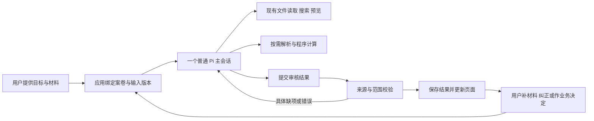

# 审核功能收敛设计：普通 Pi Agent 与简洁工作台

日期：2026-10-09；现状补记：2026-10-10。核对对象为当时工作区的审核代码，提交基线 `60c25542`；参考 [13 的源码阅读和隔离试用](13-single-agent-framework-trial.md) 与 [15 模板模块和运行时边界规范](15-template-modules-and-runtime-boundary-spec.md)。**本文是设计核对快照，不是当前实现状态表。** 批量审核 A/B 与受授权 C 阶段后续已在 `feat/batch-review-triage-v1` 接入页面与服务；当前状态、测试结果和未完成验收见[开发者交接](17-current-state-and-handoff.md)。本文没有覆盖这些实现及其 UI 验收。

## 1. 要解决的问题与取舍

让使用者提供目标、审核依据和材料，点击开始，一个正常的项目 Pi Agent 自主读取、搜索、查看图片和分析，结果回到同一页面。软件负责可靠的材料服务、保存、出处校验和业务操作。

默认只需要理解三个问题：交了哪些材料；发现了什么；下一步做什么。模板、人工审批、历史、完整证据、评分和诊断仍然存在，按任务需要出现。

当前决定：

- 保留项目 Pi 内核及正常的 Agent 会话机制；默认一个主 Agent 完成一案。
- 复用现有案卷、模板版本、材料、引用、补件、人工认定和报告服务。
- 将自动审核的技术步骤改成 Agent 可使用的能力，不强制先摘要规则、再提取事项、再换会话检查。
- 案卷工作台合并为一个入口；默认两栏，原件按需展开。
- 日常 Agent 以项目已有文件工具为主。结构化结果接入优先只增加一个提交能力，不新增另一套 Agent 框架。
- 正式审批、教师/评委权限和人工纠正继续由业务服务控制。分析完成与业务批准分别表示。

13 的试用支持“最小 Pi 配置能够完成所测核对”，没有证明全部真实模板已经可靠，也没有证明普通项目会话加载全部工具后的成本与试验相同。下一轮需要验证应用中的真实接入。

## 2. 已有功能与实际差距

下表的“已有”表示存在相应实现。是否稳定可用仍以具体端到端验收为准。

| 功能 | 已有实现 | 下一轮处理 |
| --- | --- | --- |
| 建案与恢复 | [CaseManagerBar](../../../apps/electron/src/renderer/components/content-review/CaseManagerBar.tsx)、[CreateCaseDialog](../../../apps/electron/src/renderer/components/content-review/CreateCaseDialog.tsx)、[V2CasePanel](../../../apps/electron/src/renderer/components/content-review/V2CasePanel.tsx) | 合并新建/选择入口。目前工作台建案与模板建案使用不同表单、状态和数据路径；工作台还要求申请人、学年、审核类型、领域包 |
| 分开添加材料、移除、排序、折叠 | [LeftPanel](../../../apps/electron/src/renderer/components/content-review/LeftPanel.tsx)、[CenterPanel](../../../apps/electron/src/renderer/components/content-review/CenterPanel.tsx)、[ReviewMaterialControls](../../../apps/electron/src/renderer/components/content-review/ReviewMaterialControls.tsx) | 保留两种上传目的及编排功能；文件行默认简短，原文不常驻铺开 |
| 多选/拖入和 Agent 导入 | [MaterialDropZone](../../../apps/electron/src/renderer/components/content-review/MaterialDropZone.tsx)、[material-service](../../../apps/electron/src/main/lib/review/material-service.ts)、[pi-review-ops-tools](../../../apps/electron/src/main/lib/adapters/pi-review-ops-tools.ts) | 点击、拖入和 Agent 共用材料登记服务；不要求用户先理解“材料槽”才可收录文件 |
| 复杂格式与可追溯引用 | [document-parser](../../../apps/electron/src/main/lib/document-parser.ts)、[case-import](../../../apps/electron/src/main/lib/review/case-import.ts)、[document-capability-library](../../../apps/electron/src/main/lib/review/document-capability-library.ts) | 文本/单元格/页图按需读取，修复长块无法继续读取、图片失败缓存及问题相关性不足的情况 |
| 模板分项、可修改与移出目录 | [TemplateWizardPanel](../../../apps/electron/src/renderer/components/content-review/TemplateWizardPanel.tsx)、[template-store](../../../apps/electron/src/main/lib/review/template-store.ts)、[template-catalog](../../../apps/electron/src/main/lib/review/template-catalog.ts) | 保留已发布版本不变、修改产生草稿、目录排序与移出；默认编辑只呈现业务信息 |
| 预算合计、编号唯一性、条件与计分 | [TemplateSheetCheckSpec](../../../packages/shared/src/types/review-v2.ts)、[v2-executor-factory](../../../apps/electron/src/main/lib/review/v2-executor-factory.ts)、[deterministic-engine](../../../apps/electron/src/main/lib/review/deterministic-engine.ts) | 已有固定计算及接线，不能再笼统写成“完全没有确定性核对”；拆出可复用计算服务，保留单元格来源、缺值和公式警告 |
| 补件、事实修正、证明关联、人工认定、最终决定 | [application-service](../../../apps/electron/src/main/lib/review/application-service.ts)、[workspace-business-service-v2](../../../apps/electron/src/main/lib/review/workspace-business-service-v2.ts)、[decision-readiness-v2](../../../packages/shared/src/review/decision-readiness-v2.ts) | 保留持久化与权限；减少同一问题产生多张待办和多个确认表单 |
| 来源点击定位、报告与历史 | [SourceBlockView](../../../apps/electron/src/renderer/components/content-review/SourceBlockView.tsx)、[RightPanel](../../../apps/electron/src/renderer/components/content-review/RightPanel.tsx)、[report-export-v2-service](../../../apps/electron/src/main/lib/review/report-export-v2-service.ts) | 默认只显示本次结果；来源打开原件，导出区分当前/历史与未完成范围 |
| 批次与评委服务 | [batch-store](../../../apps/electron/src/main/lib/review/batch-store.ts)、[judging-service](../../../apps/electron/src/main/lib/review/judging-service.ts)、[rating-service](../../../apps/electron/src/main/lib/review/rating-service.ts)、[BatchPanel](../../../apps/electron/src/renderer/components/content-review/BatchPanel.tsx) | **此行是 2026-10-09 快照，批次页状态已被 A/B/C 阶段实现取代。** 当前批次队列、恢复/定向重试、问题组人工处理和受授权的自动补件/通过见 [16 规范](16-batch-review-automation-and-issue-clustering-spec.md)、[C 阶段验收](17-batch-review-stage-c-local-acceptance.md) 与[交接文档](17-current-state-and-handoff.md)；新分支的真实 UI 场景仍待手动验收 |

### 2.1 已经确认的主流程问题

1. **通用 Agent 还没有直接完成审核。** `review_start_run` 调用 `startReviewRunAsync`，再创建内部审核模型客户端。通用 Agent 主要查摘要、登记材料、发起运行和查询结果，材料正文并不直接提供给它。
2. **内部运行受技术流水线支配。** `review-run-graph.ts` 将每个 auto-check 展开成 10 个串行技术节点；`pi-review-agent-client.ts` 每次语义调用建立临时 transcript 并删除。`toolProfile='review'` 禁用普通文件/产品工具。模板业务阶段和 Agent 的实际思考步骤混在了一起。
3. **“一键”会在自动步骤之间停下。** `runFullReview()` 先生成规则摘要，要求人工确认全部规则包，再提取事项；事项为空就不进入审核。这会让能够直接读原件的 Agent 等待中间格式准备。
4. **提交后过早终止。** 专用工具接受所需结果后返回 `terminate:true`，客户端可能使用“Pi 未返回最终摘要”的兜底文本。结构化结果已经有效，不代表必须中断正常会话；反过来，有工具调用也不代表任务完成。
5. **页面的数据入口仍分裂。** 普通工作台使用 `reviewCaseAtom` 及按案缓存，V2CasePanel 使用独立的 `reviewV2AggregateAtom`；旧案有 V1→V2 投影，同 ID 不等于所有读写已经统一。新原生 V2 案卷也不能假定必有 V1 文件。
6. **授权入口与真实会话没有自然衔接。** `ReviewAssignmentCard` 写入 `local-main` 和生成的 turnId，工具校验却绑定真正 sessionId；需要由实际发起审核的项目会话绑定任务，不能把 UI 占位身份当正常会话身份。
7. **待办含义过多且重复。** view-model 同时投影检查、候选事实、关联、未读材料、缺槽、补件和逐事项认定，RightPanel 又显示最终决定的阻塞清单。当前代码已经折叠原文、历史及部分高级操作；下一轮重点是收敛数据和任务，不能仅再加折叠框。

## 3. Agent 如何适配

### 3.1 默认执行方式



应用预先完成原件收录、版本绑定和轻量目录准备。主 Agent 得到目标、必要的规则/检查清单、材料路径和已确认人工信息。少量文本可以直接给出；较大材料通过文件读取，图片只看相关页。

Agent 自行决定先读哪些文件、是否搜索、是否查看图片、是否需要计算。模板可以规定“核对哪些业务要求”，不规定“必须以某个顺序调用哪些工具”。业务阶段仍控制谁可以审批；不再把 OCR、提取、绑定等处理强制展开成每案必经的 Agent 阶段。

“开始审核”从工作台发起时建立或继续一个正常的项目案卷会话；之后的核对、修正和追问使用这个会话。用户在已有通用会话明确要求处理本案时，将同一任务上下文绑定到该会话，避免由它调用另一个内部推理 Agent，再自己轮询总结。

模型、上下文、输出限制和思考设置沿用项目渠道及会话配置。默认配置只启用本案需要的已有文件/预览能力，其他产品能力按需加载，避免把全部产品工具 schema 一次提供给模型。

### 3.2 自定义能力的必要边界

只有阅读材料、输出文字报告时，正常 Pi 配上文件和目标即可工作。页面需要保存可核验的检查、更新待办、保留人工纠正，因此仍需要一层轻量的结果接入。**这层承担业务保存，不另外教 Agent 一套审核执行算法。**

默认先提供一个 `review_submit_result` 能力，绑定案卷、运行、输入哈希和操作者由应用注入，模型不用反复填写这些内部信息。载荷使用现有检查状态、规则/目标和来源类型，含简短摘要、检查结果，以及必要时的事项/事实候选；重复调用可保存进展，最后明确请求结束。

提交服务：

- 校验出处属于当前材料版本，引用存在，目标属于正确分项；新事项候选由服务分配稳定 ID。
- 程序可验证的数值通过已有解析值/候选引文核对，并调用现有计算逻辑；不直接把模型算出的金额当程序结果。
- 逐项返回 accepted/rejected/missing，保存有效部分；模型可以在同一会话修正具体失败项。
- 检查的已核对范围、缺项和结束请求分别处理。不因第一次成功写入终止 Pi，不以模型一句“完成”认定全案完成。
- 摘要与结构化结果分开验证。有有效检查但摘要缺失时，页面按保存结果生成简短说明，明确实际完成范围；不为修饰摘要再启动 Agent。
- 使用现有命令事务、revision 与幂等机制。运行结束/取消后拒绝迟到写入，人工确认值不被候选事实覆盖。

首轮可以复用 `review-tools.ts` 的验证函数和现有材料能力作为过渡。最终工具形态以普通读取、搜索和预览的体验为准，不要求永久保留十三个专用工具。

### 3.3 材料工作区与出处

每案提供可读目录，例如 `依据/`、`材料/`、`解析/`、`结果/`。原件与解析文件由应用管理；Agent 可以写工作笔记/结果，正式案卷数据通过业务服务保存。

现有文件权限、预览与授权目录校验优先复用。若通用工具不能保证案卷范围，暂用现有受限读取工具；只指定 cwd 不等于文件隔离，也不以开启 `bypassPermissions` 换取方便。导入的规则、同名 AGENTS/SKILL 文件等按材料数据读取，不自动装成执行指令。

解析文本行/表格单元格/页图保留到 `DocumentVersion + parseRevision + SourceRef` 的映射，Agent 的文件位置引用可以转换为现有定位。Word 无可靠页码就用结构位置，不伪造页码；图像事实关联实际查看页及识别结果。

大结果写入派生文件，工具返回短预览和恢复路径；必须能分页读到末尾，不能截断后视为全文已读。缓存按原件哈希、解析配置及解析器版本建立。图片核验缓存还需包含问题范围/核验配置，失败允许重试，不能缓存一次失败就永久跳过该页。

Docling 仅作为复杂材料的可选服务。普通文本与现有 XLSX 单元格路径继续使用；需要 PDF 坐标或更完整 Office 结构时再调用。13 已验证“同一主 Agent 读取页图”可用，但项目当前的 Pi 流式图片传输仍需按实际渠道验证。兼容修复属于模型传输能力，不包装成新的视觉 Agent。

### 3.4 范围与完成标准

模板/用户确定审核目标和有效依据。直接引用已选择的依据原文可以开始分析；只有适用年份、条款冲突、提取歧义或用户要将 AI 摘要发布为规则时，才提出具体确认。取消“一切审核先人工确认 AI 规则摘要”的普遍前置条件。

检查完成与材料覆盖分别记录。定位到一个相关段落只表示它被读取；不能伪装成完整审阅。对声明整份审核的材料仍核对覆盖缺口。非本次范围的附件保留，说明排除理由；不能仅靠模型说“无关”消除必需证据缺口。必要依据须包含适用条件、例外和定义，不能只抽一个有利句子。

同一输入下重试失败项时保留已接受的结果。补件、修改事实或更换规则后产生新输入版本；首轮只自动复用解析/页图，旧检查继续作为历史参考。后续有可靠依赖记录才跨版本复用检查：分项变化影响该分项，重复计分等整案规则需重新检查。不先承诺任意新增材料都能精确局部续跑。

## 4. 简洁页面设计

### 4.1 一个案卷工作台

默认导航为 **审核、模板**；设置放页头菜单或复用项目设置。批量入口只在完整配置流程就绪后从案卷列表/更多功能进入；示例数据位于明确的示例入口。

原生 V2 和历史案卷共用案卷列表、新建窗口、材料操作与结果视图。模板页面只管理模板，“使用模板”直接进入同一个工作台，不再内嵌第二套完整案卷管理页。

默认布局示意：

```text
材料审核   [本次任务 ▾]   [模板：综测 ▾]        [开始审核] [更多]
──────────────────────────────────────────────────────────
材料与依据                         审核结果
审核目标：核对分项要求和重复计分       已核对 8 项；2 个问题，1 项未完成

审核依据           [+ 添加依据]      竞赛成果重复申报
  2026 综测细则.pdf        [⋯]        出现在两个分项；查看两处证据

待审材料           [+ 添加材料]      [查看来源] [处理]
  ▸ 科研与竞赛  3 份
  ▸ 志愿服务    2 份                 证书第 1 页尚未核验
  ▸ 通用附件    1 份                 [重试这一项]

点击文件查看原件                     ▸ 已核对项目 8
                                    [导出报告]
                                    ▸ 核对过程与历史
```

左栏为材料目录和目标，约占 35%；右栏为结果和处理，约占 65%。点击文件或结果引用时打开可收起的原件区域/抽屉，保留问题上下文与“返回结果”；需要对照时才形成三栏。窄屏使用“材料/结果”切换，证据点击自动进入原件。

### 4.2 首屏只保留必要操作

| 场景 | 默认出现 | 按需展开 |
| --- | --- | --- |
| 未建案 | 新建任务、最近任务 | 示例数据、历史导入 |
| 新建 | 任务名称、审核目标；模板可选 | 申请人、学年等由模板按需要呈现，不同时要求审核类型与领域包 |
| 准备材料 | 两个独立上传区、文件名、分项；异常状态 | 材料槽映射、版本、解析内容、全部字段 |
| 运行中 | 当前正在处理的文件/问题、停止 | 模型调用、用量、详细过程 |
| 有结果 | 简短汇总、问题/补充要求、证据、继续核对 | 已通过检查、全部提取事实、业务审批、历史 |
| 出错 | 具体未完成范围和可执行恢复动作 | 原始错误、HTTP 信息、内部工具回执 |

主按钮随当前任务变为“开始审核”“停止”“继续核对”或“更新审核结果”，同一页面只有一个主要运行入口。没有依据时，可以做用户指定的材料内部一致性分析；报告明确范围，资格/积分等依赖政策的检查保留缺口。没有清单的自由分析不显示伪造的检查通过率或正式批准按钮。

“模板可选”是用户可以不选业务模板；为兼容现有 `templateId/templateVersion` 存储，新建自由分析案卷仍绑定一个最小的系统通用分析模板。运行记录注明分析用途，允许只有目标、来源与报告；不把现有零有效规则的正式审批阻塞条件当作分析任务失败。用户转入正式业务时明确选择业务模板及版本并产生新输入，不悄悄给自由报告补审批资格。

辅助审核页的任务设置区应能直接载入已发布模板版本。左栏“添加审核依据”提供上传文件或手写依据两个入口，二者并存；AI 生成的规则摘要也能在原位置手动调整，文件来源锚点保留。模板发布版不被本案修改覆盖。每次调整模板版本或本案规则都进入新输入指纹，使旧运行清楚标为历史结果。

新建草稿允许先上传再识别字段/事项。现有 `createCaseFromTemplate` 在建案时校验必填事项/分项，需要将完整性校验放到对应的业务提交关口；不能简单删除校验。自由分析与正式业务提交共用工作台，后者仍满足模板必填与审批要求。

### 4.3 上传与文件编排

- **审核依据与待审材料始终分别添加、分别清空。** 布局收敛不合并这两个语义角色；证明与申报可在待审材料内按分项/用途分组。
- 点击选择和拖入共用服务。上传先成功收录，未明确的槽位/关联作为候选；只有明确影响对应检查时才要求用户调整。
- 文件默认一行，点击预览；长文和含图片文档默认折叠，图片存在不等于内容已核验。
- 每行保留可发现的更多/移除操作，键盘可用；移动、排序、改分项在菜单内，同时支持拖动排序。排序是用户编排信息，不强迫 Agent 以相同顺序读取。
- 组级“清空”放组菜单并明确作用范围。移除影响当前输入，保留原件版本与历史结果；清空依据不清空待审材料。
- 分项材料关系使用现有 slots/subjects/evidenceLinks，不引入默认可视化链路编辑器。必要时展开“用于哪些分项/事项”，公共材料可供多个分项引用。

### 4.4 结果与人工处理

默认展示问题、需补充和未完成；符合项折叠为“已核对项目”。每张问题卡只保留标题、一句原因、来源和一个“处理”入口，展开后选择确认问题、修正事实、补件或忽略并说明原因。正式判断需要的操作不藏到无法发现的位置。

相同分项/事项的同一根因聚合为一个可处理问题，内部保留关联 check/fact/link/supplement ID。一次操作写入有明确作用范围的业务命令，并重新计算关联待办；不能通过删除多条记录来减少数量。

已提供且没有冲突的可定位信息用于分析，不为每个普通字段强制弹人工确认。需要用户的具体原因必须明确，例如“成员名单不一致”或“8 分缺少当年分值表”。模型自报 confidence 只用于内部参考，不单独以百分比要求用户确认。

**分析完成时不强制逐事项终审。** 用户选择“办理认定/审批”后进入已有业务关口，继续核对正式要求、必需事实与证明、事项认定、评分、角色及未完成检查。第一次收敛不放松现有 `assessDecisionReadiness` 的正式决定门控；其逐字段/全附件要求若要调整，须明确模板范围与证据规则后另行实施。

结果状态统一使用现有枚举，并提供固定含义：

| 状态 | 展示与处理 |
| --- | --- |
| `compliant` | 已有充分证据支持该项符合；不等于案卷批准 |
| `non-compliant` | 已有事实明确不满足要求；金额差额/重复编号等直接显示问题 |
| `awaiting-supplement` | 明确缺少必要材料或字段，列出补充内容 |
| `awaiting-confirmation` | 已有资料存在歧义、缺少适用规则，或规则明确需要人工判断 |
| `not-executed / execution-failed` | 本项没有完成，给出失败范围与重试入口，不能改名为正常人工待办 |
| `not-applicable` | 说明不适用条件，保留所用范围 |

“缺少批准记录”与“记录明确显示尚未批准”不能仅按提示词措辞任意换状态。模板若要求已经批准，后者是已知条件未满足；模板若安排后续人工批准，它是待办阶段，不应判成材料本身违规。无校规分值表只影响积分认定，已有数字一致性仍可以完成。

### 4.5 追问、历史与授权

问题卡的“询问”打开本案正在使用的主 Pi 会话，附带当前问题和引用；用户可以继续要求核对或补充材料。原 AssistantDrawer 的独立问答路径逐步收敛，不让用户辨认“能操作的 Agent”和“只回答的助手”。重新打开应用时恢复会话/任务记录，不把已中断运行显示成仍在执行。

“开始审核”由应用创建本案、本次输入、实际 sessionId 的任务授权，允许它完成分析和提交结果。普通用户无需先去另一页创建 assignment 或复制 ID；既有通用会话处理案卷时同样绑定明确的案卷范围。撤销/停止后不允许继续写入。

一次用户任务的合法后续模型/压缩恢复调用延续相同范围，不因内部来源名称变化要求用户反复确认；独立自动任务或其他会话不能借用这份授权。AI 代批保持现有独立开关和角色门控，普通“开始审核”不授予正式决定权。

历史、内部节点、版本哈希和用量放“核对过程与历史”。默认结果只引用本次有效输入；更换材料后提示旧结果需更新，历史可查。报告导出保持问题、出处、未完成范围和人工处理信息，不能把所有历史运行混入当前结论。

## 5. 数据与代码调整方式

采用 **V2 聚合为新案卷的唯一业务事实来源**，页面通过一个按 caseId 的 Jotai 状态读取快照。保留旧案读取与迁移适配，不要求用户重新上传。

首轮先建立统一案卷查询/动作门面：合并两种列表，按 caseId 去重；原生 V2 直接读取；旧案只在实际修改旧输入或明确迁移时同步投影，不在每次渲染中让两个模型互相覆盖。保存人工 observation、证据绑定、补件、认定和决定的 supersedes/history 链。

| 代码区域 | 保留与调整 |
| --- | --- |
| `ContentReviewView`、`CaseManagerBar`、`CreateCaseDialog` | 统一任务入口、两栏/按需原件、简化新建；复用窗口拖拽/窄屏/键盘行为 |
| `LeftPanel`、`CenterPanel`、`ReviewMaterialControls`、`MaterialDropZone` | 提取共用材料目录与上传操作，保留角色、排序、删除和引用定位 |
| `RightPanel`、`review-workspace-view-model` | 区分分析结果与正式决定，聚合同一根因的待办；主按钮由同一个执行状态派生 |
| `review-atoms`、控制器、`V2CasePanel` | 合并按案状态和动作来源；模板页面移除第二套案卷工作流，复杂业务操作转为按需面板 |
| `run-async-service`、`pi-review-agent-client` | 保留去重、取消、持久化及恢复记录；转接正常 Pi 案卷会话，停止逐语义节点新建临时会话 |
| `v2-executor-factory`、`review-run-graph` | 保留规则/范围/计算函数与历史产物读取；技术步骤成为可选服务，模板人工阶段仍按业务服务推进 |
| `pi-review-ops-tools`、`pi-builtin-tools`、授权管理 | 注册按案结果提交和必要操作；真实会话绑定替代 `local-main`，避免通用 Agent 调内部 Agent再总结 |
| 案卷/模板/材料/补件/决定/报告服务 | 继续作为 UI 和 Agent 共用服务，保护版本、引用、权限和人工记录 |

普通 Pi 的文件/预览工具与图片协议属于共同基座。审核侧先做任务绑定和服务接入，公共适配器的必要接口变更列为协作依赖，不重写通用 Agent。旧运行图保留读取与旧流程兼容；新流程稳定通过验收后才停止新案使用旧技术流水线。

## 6. 实施顺序与功能验收

| 顺序 | 可交付结果 | 判断完成的行为 |
| --- | --- | --- |
| A：真实接入普通 Pi | 一个持续会话、案卷文件访问、校验后结果提交、去重与取消 | 同一 Agent 在应用内完成金额一致/差额/重复/缺值/扫描页核对；拒绝的引用能够定向修正；有可追溯结果和摘要 |
| B：工作台收敛 | 统一建案与状态，两栏、独立上传、结果与原件联动 | 普通用户在一个页面完成选模板/上传/开始/看结果；原生 V2与旧案都能恢复；模板页不再另开一份当前案卷 |
| C：待办与业务闭环 | 结果根因聚合、同一会话追问、按需正式决定、版本更新 | 纠正一次更新相关卡片；补件后继续；有效结果保留；审批门控不因为简化页面而消失 |
| D：模板默认编辑 | 名称/用途、分项、要求、材料、可选计算；高级配置保留 | 综测多个分项仍属一案；已发布模板修改产生新草稿，排序/移出/恢复不影响旧案 |

先用活动预算与竞赛证书打通 A，再交付 B；不先全面重写所有模板、换框架或增加多 Agent。每一步保留可运行版本和原有数据，默认路径切换只发生在新链路通过相应功能验收之后。

首轮必须覆盖：

1. 独立添加/清空依据与材料；多选/拖入/Agent 导入一致；单文件移除、排序、折叠后引用仍可定位。
2. 1,680 与 1,480 输出差额 200 并指到真实数值；缺值不当 0；重复引用两处；缺政策不妨碍内部一致性检查。
3. 长文末尾与第 25 张图片能按需读取；扫描页识别结果有实际视觉记录；图片服务失败只显示对应页未完成。
4. 一个综测的多个分项分别适用要求，公共附件可复用，专属证据不能跨分项充数；重复成果仍按整案核对。
5. 同输入单项提交被拒能继续修正；停止后无迟到写入；重开页面恢复记录，中断任务可继续，不生成幽灵运行。
6. 新材料/人工纠正后旧输入结果不得用于当前正式决定；历史保留；新运行不把已确认值覆盖成模型值。
7. 默认只显示本次问题及具体动作；无问题也能打开已核对项目与导出；自由分析不冒充正式认定，正式业务仍校验角色和必需事项。
8. 旧案、原生模板案卷、模板高级配置和旧运行产物均可读取，UI 与 Agent 对同一案卷操作不会串案。

实际效率使用同模型、同任务和同材料比较旧/新应用流程，记录真实模型请求、含缓存的输入、输出、完成时间及功能正确性。格式、状态分类和来源定位分别核对；不以流程结束、全转待确认或 UI 卡片减少代替审核完成。本轮不安排视觉精修、压测或通用框架升级。

## 7. 2026-10-10 现状补记

### 批量审核界面

批量审核已从示例占位页改为真实数据页：能列出持久化批次、切换批次、展示项目名称/申请人/进度/待处理状态/最近更新，并从已发布模板和已有审核项目创建批次。项目行会按案卷类型打开 V2 案卷页或旧版审核工作台。状态来自批次条目、V2 案卷阶段和最近一次 V2 运行记录。

以上两段是 2026-10-10 较早的实现快照，已被 `feat/batch-review-triage-v1` 的 A/B/C 阶段实现取代。当前批次页有队列执行、恢复/定向重试、分流、问题组人工处置和受授权自动处理入口；策略及测试边界见 [C 阶段验收](17-batch-review-stage-c-local-acceptance.md) 与[当前状态交接](17-current-state-and-handoff.md)。新功能仍待真实 Electron UI 场景验收。

### 上游同步

本次核对到上游 `Nya-Angle/CDUT-Studio` 的 `main` 最新提交为 `0a9ef5af`（合并 PR #14）。审核入口跟随上游 CDUT 专区的导航结构，批次页作为审核二级页面接入；审核专属 Pi 工具仍按审核会话和工具组启用。当前同步只以该次 fetch 确认到的 `main` 为准。

### 模板模块规范

[15 号规范](15-template-modules-and-runtime-boundary-spec.md)已经定稿，已阅读。它明确了模板目录、完整业务模板和复用模块的边界，建议先把少量完整模板及其验收材料跑稳，再从实际重复部分提取模块；审核运行时继续接收编译后的完整模板快照，不让审核 Agent 理解模块化编辑概念。文档描述的是后续基座设计，不表示模块库、组合解析器或冲突检查已经实现。业务材料尚未准备，因此这部分暂不进入实施。

### 本轮代码验证

本次同步后已运行类型检查、批次存储测试和 Electron 主进程/预加载/渲染构建。它们能验证代码兼容与可构建，不替代应用内交互验收；交互验收需在应用启动后由实际使用者完成。
