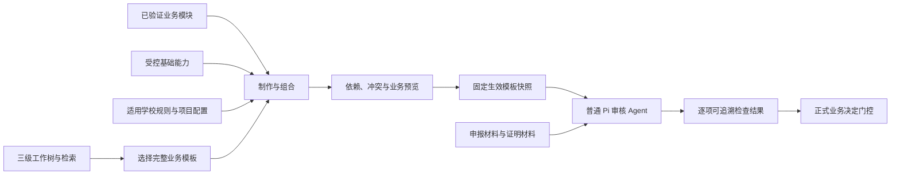

# 审核模板模块化与运行边界规范（v1）

> 日期：2026-10-09  
> 状态：**第一版设计规范已定稿；模块库、组合解析器和私有差异叠加尚未据此完成开发。**  
> 范围：审核模块内的模板研究、制作、复用、发布、Agent 审核与质量验证之间的边界。  
> 来源：由原《审核模板模块化与运行边界：讨论稿》收敛，并纳入本轮确认的业务划分、模块契约和验证流程。  
> 相关文档：[02 产品与模板](02-product-and-templates.md)、[04 验收与评测](04-acceptance-and-evaluation.md)、[14 Pi 原生审核与简洁工作台](14-pi-native-review-and-simple-workspace-design.md)。

## 1. 目标、范围与基本取舍

审核模块作为一个完整产品域进行设计，涵盖业务模板研究与开发、模板管理与选择、审核执行及测试验收。各部分可以协同调整，但**模块化不等于模板选择，不等于重新设计审核 Agent 的推理流水线**。

本规范优先解决三个问题：

1. **新模板更容易做对。** 已验证的业务审核知识可以复用，减少重复研究、规则漏项、错误套用及重新测试。
2. **新模板更容易制作。** 完整模板可以引用已有业务模块与基础能力，仅补充业务特有要求，而不是每次从零开始。
3. **已发布模板更容易维护。** 公共知识可以统一修订并提示影响范围，同时保留已发布版本、历史案卷及审核运行的原始口径。

衡量成效主要看模板开发与维护成本、审核正确性、误杀与漏放、版本可追溯性；**不以模块数量、拆分粒度或代码复用比例本身作为成功标准**。

首版坚持轻量：保留自然语言承载复杂业务语义，给稳定 ID、版本、参数和依赖等必要信息增加结构化约定；不预先建设图形节点编辑器、完整业务 DSL、任意代码执行系统或大规模自动冲突裁判。

## 2. 先分清四个不同概念

### 2.1 三级工作树：帮助找到模板

三级工作树是面向业务的**模板发现和选择结构**。层级逐步缩小业务范围，让专门的决策模型能够分步筛选，普通语言模型也能利用清晰的分类、名称和说明找到适用模板。

- 工作树节点用于分类、检索、路由和解释“为什么选这套模板”。
- 工作树层级**不自动继承审核规则**，不决定模块的层级，也不参与模块冲突求解。
- 模板选择完成后，再加载该模板的固定版本与适用配置。两者可以使用同一份模板元数据，但应保持职责分离。
- 三级是当前组织方式，不必让每一项独立审核目的都机械地凑足三个实际审核步骤。

### 2.2 一套统一模板目录：按独立审核目的划分

正式产品使用**一套统一模板目录**，不另建互相重复的“跨校通用模板库”和“成都理工大学私有模板库”。

新增独立模板的关键依据是：是否具有独立、真实、可说明必要性的审核目的，以及相对明确的材料与判断边界。共同字段、类似材料、同属一个行政领域，均不足以证明两个事项应合并；一个真实事项的存在，也不足以证明值得专门增加一个所有用户可选的模板。

业务研究优先验证成都理工大学的真实需求；其他高校官方制度、表格、办理指南和有依据的实际案例用于交叉验证、补足通用业务。成都理工大学当前缺少现成线上入口，不妨碍设计有充分证据支持的可复用审核模板。

不同学校的**规则差异**优先用参数、条件和有权限的配置表达，而非复制完整模板。稀少、特殊或高度依赖人工授权的事项，优先考虑既有模板的条件分支、角色限定、后台配置或转人工。只有出现真正独立且有价值的审核目的，才新增模板。

**注意：** 为测试覆盖复杂边界，可以从其他学校选取较严格的示例规则；这不代表产品在真实审核时可以将其他学校的严格要求自动施加给当前学校。正式判断以本案实际适用的有效依据为准。

### 2.3 可复用模块：帮助制作和维护模板

模块化是**模板工程机制**。它不直接承担工作树路由，也不要求模板用户理解模块内部结构。模块是否值得抽取，以其审核目的是否稳定、跨模板复用是否真实、组合后能否保持原业务含义为标准。

### 2.4 完整模板：定义一次独立业务审核

完整模板负责说明这一业务审什么、需要什么材料、哪些检查适用、怎样解释局部检查之间的关系、何种情况需要补件或人工决定，以及允许输出什么结论。

**可复用不等于可任意叠加。** 完整模板不是简单的规则集合求并集，而是经过业务目的、适用范围与冲突校验的有效审核要求。

## 3. 三个层次：基础能力、业务模块、完整模板

| 层次 | 主要问题 | 典型内容 | 不应越界的事 |
| --- | --- | --- | --- |
| **基础能力（How）** | 如何获取、比较或计算事实 | 读取文件/页图、提取字段、跨材料比对、核对日期、合计、唯一性检查、定位来源 | 自行创造业务政策或决定是否批准 |
| **业务审核模块（What / Why）** | 为何核查、在什么条件下核查、如何解释结果 | 证明主体一致性、成果有效期认定、重复申报核对、金额一致性检查 | 脱离适用条件直接宣称整案通过 |
| **完整业务模板（Business）** | 对某独立事项应怎样完成审核 | 综测成果认定、奖学金资格审核、经费报销等 | 把其他业务的规则不经论证直接叠加进来 |

**解耦的是实现能力与业务语义，不是将业务语义拆成无意义的碎片。** 一个业务模块应尽量保留完整的审核目的、输入条件、判断要求、例外和输出含义；底层功能可以高度通用。

举例：

- 报销申请金额 1,680 元，票据明细合计 1,480 元：是**跨材料金额一致性**问题，关注差额 200 元及可能的补正。
- 资助申请金额 1,680 元，适用制度上限 1,500 元：是**额度政策合规性**问题，关注超额 180 元及制度规定的处理方式。

二者可以复用数值提取、比较和引文核对能力，却不应强行归并为一个没有业务解释的“数字比较审核模块”。

模块拆分的底线是：**复用后不应要求模板作者每次重新补齐原本应该由模块承担的核心审核语义。** 若某规则只在一套模板中存在且抽取后没有可见维护收益，可以继续留在模板中。

## 4. 制作平面与审核平面分离

**制作平面可组合，运行平面只消费成品。**



模板作者（包括辅助制作模板的 Agent）可以理解模块引用、参数、差异、依赖和出处；**实际执行审核的普通 Pi Agent 只需要理解最终的审核目的、适用依据、材料和检查要求**，可以自主决定读取、搜索、查看图片、计算与提交结果的顺序。

模块不是每次审核都要动态解析的一串工具调用或固定思考节点；模块组合发生在发布或绑定本案有效输入前。解析后的内容优先兼容现有 `TemplateVersion`、分项及检查结果模型，避免平行建造第二套审核执行引擎。

> 运行时允许按需使用基础工具，但模板不得将“依次调用哪些工具”与“必须完成哪些业务检查”混为一谈。

## 5. 第一版模块契约

模块使用**少量结构化元数据 + 可读的业务规则文本**。推荐记录以下七组信息；不要求第一版将它们全部实现为复杂的数据对象或封闭枚举。

| 信息组 | 第一版必须回答的问题 | 约定 |
| --- | --- | --- |
| ① 身份与用途 | 模块叫什么、审核目的是什么？ | 稳定 `moduleId`、固定 `version`、简明名称及用途说明 |
| ② 输入与适用条件 | 审什么对象，依据什么，何时适用？ | 需要的材料/事实/依据、作用范围、例外与不适用条件 |
| ③ 新增的检查 | 实际增加哪些判断？ | 规则含义、可观测结果、所需出处，尽量可独立验证 |
| ④ 可配置参数 | 哪些部分允许本地变化？ | 参数名、含义、单位、可选范围、默认值来源；未开放的规则不可任意改写 |
| ⑤ 依赖与冲突 | 依赖哪些能力/模块，可能与什么要求冲突？ | 固定引用、必需能力、已知互斥或替换目标；缺依赖必须显式报错 |
| ⑥ 输出含义 | 该模块能对什么负责？ | 局部检查结果、缺项及证据；不越权作出整案决定 |
| ⑦ 示例与验证 | 怎样证明语义在复用时没变？ | 最小正例、反例、边界例及关联测试包；说明不支持的情况 |

结构可按实施需要逐步落地。原则上，ID、版本、引用、参数类型和依赖这类需要机器判断的内容应结构化；政策解释、业务例外、证据说明可以先保持自然语言。不要为了格式统一而削弱可读性。

### 5.1 模块最小示例（说明性示例，非固定数据协议）

```yaml
moduleId: review.amount-consistency
version: 1.0.0
purpose: 核对申请金额与票据明细合计是否一致
scope: 当前报销事项
inputs:
  - 申报金额及来源
  - 票据各项金额及来源
checks:
  - 若两侧金额可核实，计算差额并判断是否一致
  - 若任一关键金额缺失，不把缺值当作零
parameters:
  currency: CNY
requiredCapabilities:
  - numeric-extraction
  - sum-and-compare
output: 逐项符合/不符合/需补件/待确认及相关真实出处
limits: 不判断该报销是否符合费用类别政策，也不作出最终审批
```

这个模块可以被不同报销类模板复用，但不能取代单独的额度上限规则。字段与材料要求是它的输入条件，**不是判断模块等价的唯一依据**。

### 5.2 模块输出与整案决定的边界

模块只产生其职责范围内的检查结果。已有明确证据支持时可为 `compliant` 或 `non-compliant`；缺必要材料时可为 `awaiting-supplement`，存在适用规则歧义或必须人工认定时可为 `awaiting-confirmation`；尚未执行或执行失败必须明示，不能伪装成通过或正常人工待办。明确不适用时记录条件及理由。

完整模板负责组织这些检查、处理跨模块关系并决定什么时候可以进入正式业务办理。**多个局部检查符合不等于整案自动批准**；正式决定继续受模板、角色、证据、待办和人工审批门控约束。

## 6. 第一版只采用三类组合操作

### 6.1 新增（默认）

在完整模板中引入一个**独立且适用**的审核模块或检查，不修改已存在模块的语义。新增前确认其业务对象、范围、依据和已有检查之间的关系。

例如“成果属于本学年”与“成果发生于申请截止日期前”是两个可以并存的检查，前提是两者确实都由本次适用规则要求。

### 6.2 参数化（受控变化）

仅修改模块显式开放的参数，例如适用学年、截止日期、证明时效、金额上限等。参数必须保留单位、来源和适用范围；**某学校存在更严格限制，不代表其他学校自动继承**。

参数改变不能借“配置”之名静默改写规则目的、例外、审核对象或结果含义。

### 6.3 显式替换（受限操作）

确需替换已有要求时，必须明确：被替换的稳定目标、替换后规则、适用范围、制度依据、执行者权限、变更理由及差异。发布前检查依赖、影响范围和回归结果；不能靠加载顺序或“后写覆盖前写”决定。

发布后既有版本不可原地改写；替换产生新有效版本。未获得正式政策授权的个人配置不可覆盖必须执行的上位要求。

### 6.4 何为重复与冲突

至少结合**审核目的、作用对象、适用范围、所依据的规则和判断结果含义**识别潜在重复与冲突。以下情况应区分：

- **共享字段但不同业务目的**：不构成重复，例如学生姓名同时用于成果归属和本人资格核验。
- **同一目的的互补要求**：可以并存，例如资格有效期与材料真实性。
- **适用范围不相交**：可以并存，例如本科生与研究生采用不同评分细则。
- **相同范围内要求矛盾**：必须阻止静默发布，例如同一成果既允许又禁止重复计分，且两者条件完全重合。
- **重复检查同一事实**：先提示归并或显式保留原因，避免重复计分、重复补件与重复待办。

首版程序负责可确定的错误：不存在的 ID/版本、依赖缺失、引用环、配置越权、参数非法、明确的冲突声明和解析结构不合法。自然语言隐藏的业务矛盾可由模板制作 Agent 辅助审查，但**模型的“无冲突”判断不能替代实际规则依据和发布验收**。不能确定时呈现给模板作者，而不是自动决定谁优先。

## 7. 统一目录下的校本规则与私有配置

完整业务模板原则上只保留一份统一定义；学校、院系、角色、项目差异可以通过受控配置和条件分支表达，不需要因此建立平行的模板目录。

配置应保存相对目标模板/模块固定版本的**差异**，而非复制整套模板；至少能够说明应用对象、授权来源、增加了什么、改了哪个显式参数、是否存在有权批准的规则替换。

第一版在数据概念上允许标记学校、院系、个人或项目作用域，但不强行规定它们都能多级自由叠加。**实际可配置级数、各级授权和优先级属于后续业务权限设计；在没有规则时，一律不按层级高低或装载顺序静默消解冲突。**

局部习惯只能影响被允许配置的提示或行为，不得冒充正式政策。执行时必须明确最终应用的是哪份学校/部门制度、哪一年度、哪一版本，以及对应证据出处。

## 8. 发布、解析与运行时版本锁定

第一版以现有平面 `TemplateVersion`（或兼容的固定结构）作为**解析后运行对象**，而不是要求普通审核 Agent 在每案执行时解读模块引用图。

发布或开始新运行前：

1. 固定完整模板版本、所用模块版本及适用的局部差异配置。
2. 验证可解析的 ID/版本/依赖/参数/冲突与必需系统能力。
3. 合成生效的分项、材料要求、审核标准、适用条件与输出约定；保留从最终检查回到规则来源的映射。
4. 向模板作者展示**实际生效要求**及差异、缺失、冲突；通过必要的业务验证后发布。
5. 为项目/审核运行保存不可变有效快照、内容摘要与来源版本信息；正式审核以此快照为准。

模块升级和配置调整不得自动改变已发布模板、运行中的案卷或历史审核结论。需要升级时产生新版本或新输入，预览新增、删除、修改的检查及潜在影响，明确确认后应用，并保留变更记录和历史来源。

新旧输入之间可以安全复用的解析缓存，不等于可以直接复用审核结论；跨版本结果复用必须满足明确的依赖关系和有效性校验。未建立该机制时应重新审核受影响内容。

运行时提交检查结果仍需验证真实来源、适用分项和输入版本；确定性金额计算用已有受控逻辑核算，不能仅相信模型生成的数值。主 Pi Agent 不因模块来源被迫遵循固定技术步骤。

## 9. 第一版建立模块库的方法：先成品，后抽取

**不先设计几十个模块，再把上百套模板强行塞进去。** 第一轮先挑选 **3–5 套**具备可靠依据和测试材料的完整模板。既包含相近业务以观察复用，也包含不同业务以暴露错误抽象；具体事项以现有研究成熟度为准。

建议的工作顺序：

1. **独立做完模板。** 分别明确审核目的、适用角色与范围、必须材料、审核字段、具体规则、例外情况、来源和输出；可以先不考虑模块化。
2. **独立做完测试包。** 输入材料与审核依据分离；标准答案、隐藏异常清单和预期判断存放于独立测试预言中，绝不混入 Agent 的待审输入。
3. **横向比较审核目的。** 查找可稳定重用的业务判断，而不是只对照同名字段；区分“同一事实获取能力”“相似但语义不同的模块”和“完全相同的审核目的”。
4. **抽取少量高价值模块。** 每个模块写明适用条件、输入、规则、边界、配置和局部输出；没有清楚复用收益的要求继续留在完整模板内。
5. **重新组合回原始模板。** 在相同的有效依据和材料下运行原测试包，比较抽取前后行为；不得因模块化而丢失例外、出处、跨分项检查或审批边界。
6. **验证维护收益。** 模拟一次公共要求变化，统计需要改动的位置、需要复跑的测试和需审查的依赖；收益不足时调整颗粒度或撤销抽取。

首版不要求每个检查都属于一个模块，也不要求模块只对应一种固定类型。随着样本扩大，可在真实重复模式出现后建立目录、标签与制作 Agent 的复用建议。

### 9.1 回归测试必须验证什么

- **语义保持**：同一正确材料应继续正确，违规材料不能漏放，合理材料不能被新增规则误杀。
- **证据可靠**：每个关键判断能追溯到真实、已读取的来源；规则与材料不得混淆；无依据不可凭空通过。
- **边界区分**：缺材料、规则冲突、未执行/执行失败、不适用、已知不符合应各自呈现合理状态。
- **复杂材料**：在需要测试扫描件时，将奖状、印章和图文先渲染成页面图像再嵌入 PDF，确保实测包含视觉核验而非仅提取到模拟文本。
- **跨模块关系**：共享附件允许合理复用，专属材料不能越权代用；重复计分等整案要求不能因模块拆分而丢失。
- **版本与授权**：模块更新不改变历史结果；无权限配置不可覆盖正式政策；冲突和缺依赖不得静默发布。

质量测试不仅看 Agent 是否成功解析和输出，也分别看是否读到关键证据、是否理解适用规则、是否作出正确结论。对模块化前后采取同样输入与独立标准答案；测试包和标准答案均需要版本管理。

## 10. 示例：同一奖学金模板如何适配不同学校

1. 统一目录中存在一套有独立审核目的的“奖学金资格审核”模板。
2. 完整模板引用申请主体一致性、适用学年、成绩/资格核验等经过验证且真正适用的业务模块。
3. 某校的具体成绩门槛、计算口径、适用年度及必要证明，作为有来源的规则参数或明确的校本条件加入；不同校不可互相套用。
4. 院系特殊情况若有正式依据与独立条件，可以在限定作用域内补充；与已有正式规则冲突时先阻止发布并要求有权处理。
5. 编译后形成单份有效审核要求快照。普通 Pi Agent 直接读取依据与申报/证明材料，生成可追溯的局部检查结果。
6. 若只是本校某项证明不充分，提示本项补件或待确认；不能据此自动否决无关的内部一致性检查，更不能自行颁发最终审批。

类似地，两份模板都需要“申请人姓名一致性”，可以共享相同基础能力或业务模块；这**不意味着**“奖学金申请”和“综测成果认定”是同一种审核事项。

## 11. v1 验收标准与暂不实施事项

### 11.1 可以据此认定第一版规范得到验证的条件

- 至少完成 3 套有可靠业务依据、边界和独立标准答案的完整模板，并据此提出首批模块，而非先空造模块目录。
- 首批提取出的模块各有清楚审核目的、适用条件、输入、检查、输出和版本标识，能解释复用价值。
- 新增、参数化、显式替换三种组合方式有清楚边界；已知非法引用、缺失依赖、越权覆盖和明确冲突能被阻止或显式要求处理。
- 合成后的有效模板可被现有审核运行逻辑消费，Agent 无须理解模块图或重新跑一套模块执行流水线。
- 原模板测试包在重组后保持关键结论与证据质量，不增加无法解释的误判/漏判；历史版本不受新模块改动影响。
- 对新模板制作和公共规则维护至少有一次可展示的成本或质量收益；若未达到，允许保留完整模板直接编写方式。

### 11.2 第一版明确不做的事

- 不把三级模板选择工作树改造成模块继承树、模块选择器或冲突求解器。
- 不按模块个数或覆盖率设 KPI，不要求每项业务规则必须抽取成独立模块。
- 不用完整 DSL、Blender 式节点连线或自由脚本作为模板制作前置条件。
- 不自动叠加所有能检索到的政策，不按“最严格”统一裁定不同学校的实际规则。
- 不让普通 Pi Agent 自行替换正式政策、自动裁决未解决冲突或绕过人工审批权限。
- 不因设计稿定稿而宣称模块库、差异配置、冲突检查及编译器已经上线。

未来若出现必须支持的新操作、多级配置权限、复杂依赖或者决策模型选模板的进一步优化，应以独立需求及真实测试证据迭代；它们都不是 v1 模块规范成立的先决条件。

## 12. 与当前代码及既有文档的关系

目前的 [`TemplateVersion`](../../../packages/shared/src/types/review-v2.ts) 已具备字段、材料槽、分项、检查、政策引用、评分、阶段和输出等基本结构。[`template-store`](../../../apps/electron/src/main/lib/review/template-store.ts) 提供已有模板版本/结构校验；[`pi-case-review-service`](../../../apps/electron/src/main/lib/review/pi-case-review-service.ts) 组装本次审核上下文；相关确定性计算和结果校验由现有审核服务承担。

**现状与目标应严格区分：** 现有基础结构可作为扩展起点；可复用业务模块库、模块组合解析器、完整的私有配置差异模型、语义冲突审核以及升级差异预览仍属于待实现或待验证事项。以本规范作为设计与验收基准，不把“存在模板数据结构”误写成“完成模块化”。

本规范与 02、04、14 的分工为：**02 说明模板产品目标，04 说明审核正确性的验收方法，14 说明普通 Pi 审核执行与工作台，本文件专门固定模板制作侧的复用约定及其与运行时的边界。**

---

**v1 定稿原则：先从真实完整模板提取稳定业务语义；模块复用必须受适用范围与显式组合规则约束；编译后的审核要求保持平面、清楚、可追溯；最终用独立标准答案和维护成本验证模块化是否值得。**
