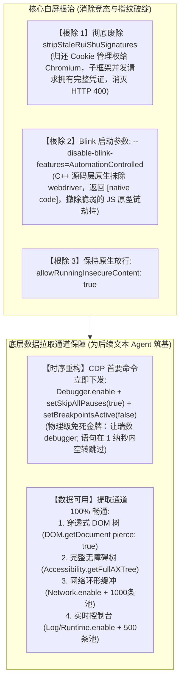

# 「砚湖秒通」多层框架瑞数防护白屏根治与纯文本 Agent 数据底座实施方案

> **文件归档**：`docs/plans/2026-10-08-yanhu-express-ruishu-frameset-remediation-plan.md`  
> **性质**：生产级技术实施方案规格书（Execution Plan Specification）  
> **面向对象**：后续执行 AI（Implementing AI）  
> **状态**：待直接执行 (Ready for Implementation)

---

## 一、 核心根因复盘与理论映射

在 CDUT Studio 砚湖秒通中，访问 B 站、百度、必应等现代单页站点正常，但访问成都理工大学青果教务系统（`xsMainV.htmlx`）时，出现**“页面纯白屏”**或**“仅加载顶层外框架、内层子框架全白”**的故障。此前五轮修复均未奏效。

结合全球前沿文献 **《Client-Side Detection and Emulation Challenges in Embedded Chromium Runtimes》** 与真实 Chrome 开发者工具实测，确定了三大致病死穴：

1. **人为破坏 Cookie 时序（多层框架白屏真凶）**：
   - 瑞数 WAF 采用“服务端会话 Cookie (`*O`) + 客户端动态计算签名 Cookie (`*P`)”校验机制。
   - 父框架 `xsMainV.htmlx` 刚由瑞数 JSVMP 动态计算出 `*P` 并渲染 `<frameset>`，内层子框架并发发起 HTTP 请求。
   - 主进程原代码在 `navigate`、`reload` 等处调用 `stripStaleRuiShuSignatures()`，强行将 `*P` 从 Cookie Jar 中删除。子框架请求因缺少签名被瑞数 WAF 返回 **HTTP 400 空包**，导致内层子框架全部留白。
2. **User-Land JS 原型链粗暴篡改被反制**：
   - 在 Preload 中使用 `Object.defineProperty(Navigator.prototype, 'webdriver', { get: () => false })` 会被瑞数探针通过 `Function.prototype.toString`（非 native code）以及新建 `iframe` 获取原生 Realm 对比（Realm Re-acquisition）瞬间识破。
3. **CDP 附着触发无限 Debugger 冻结与事件循环饥饿**：
   - 瑞数内置密集的 `setInterval(() => Function('debugger')(), ...)`。当调试器附着且未禁用断点时，V8 强制挂起调用线程，无法回退到 libuv 事件循环处理网络与渲染，造成 **Event Loop Starvation（事件循环饥饿）引发整页白屏**。
   - **Chrome 实测破解法**：在调试器附着的第一时间，向 V8 下发 `Debugger.setSkipAllPauses({ skip: true })` 与 `Debugger.setBreakpointsActive({ active: false })`，V8 在 C++ 层遇 `debugger;` 直接 `return Success`，**绝不挂起线程**。既能实现毫秒级反调试免疫，又能 100% 保持控制台、网络、元素、源码等全部能力。

---

## 二、 架构改造全景



---

## 三、 详细代码变更清单

### 1. Electron 引擎级启动参数
**目标文件**：`apps/electron/src/main/index.ts`
- **改动说明**：在 `registerProtocolsAndHandlers()` 或启动开关配置区，追加 Chromium C++ 引擎级参数：
```typescript
// C++ Blink 引擎原生将 navigator.webdriver 设为 false，访问器为原生 native code，通过瑞数所有检验
app.commandLine.appendSwitch('disable-blink-features', 'AutomationControlled')
// 优化同站多框架/frameset 内存通道与 Cookie 共享，防止严格 OOPIF 造成跨框架凭据断裂
app.commandLine.appendSwitch('disable-features', 'IsolateOrigins,site-per-process')
```

---

### 2. 砚湖秒通主调度服务
**目标文件**：`apps/electron/src/main/lib/cdut/yanhu/yanhu-express-manager.ts`
- **改动说明**：
  1. 彻底删除 `stripStaleRuiShuSignatures()` 方法定义；
  2. 移除其在 `instantiateTab`、`navigate`、`reload`、`retryTabWithClean` 中的全部 4 处调用；
  3. `navigate` 与 `reload` 直接交由 Chromium 原生 `loadURL` 与 `reload` 处理，不人为阻塞；
  4. 暴露 `getFullAXTree(tabId)` 方法，直接转发给 `yanhuDevToolsHub.getFullAXTree(tabId)`。

---

### 3. CDP 工业级总线（反断点免疫时序重构）
**目标文件**：`apps/electron/src/main/lib/cdut/yanhu/yanhu-devtools-hub.ts`
- **改动说明**：
  1. 重构 `attach()` 中的命令下发时序，**最优先执行**断点忽略与暂停跳过：
  ```typescript
  // 关键防御 1：最优先启用断点忽略，彻底解除瑞数反调试 debugger; 导致 V8 挂起与事件循环饥饿
  try {
    await this.sendCommand(buffer, 'Debugger.enable')
    await this.sendCommand(buffer, 'Debugger.setSkipAllPauses', { skip: true })
    await this.sendCommand(buffer, 'Debugger.setBreakpointsActive', { active: false })
  } catch {
    // 忽略
  }

  // 关键防御 2：断点免疫确立后，再开启其余全量数据监听域
  for (const domain of [
    'Network.enable',
    'Runtime.enable',
    'Log.enable',
    'Page.enable',
    'DOM.enable',
    'Accessibility.enable',
  ]) {
    try {
      await this.sendCommand(buffer, domain)
    } catch {
      // 忽略单个域失败
    }
  }
  ```
  2. 优化 `getDomTree` 为全穿透模式：调用 `DOM.getDocument` 时传入 `{ depth: -1, pierce: true }`，确保包含多层框架的子文档节点；
  3. 新增 `getFullAXTree(tabId: string): Promise<unknown>` 方法：调用 `Accessibility.getFullAXTree` 并安全返回 `nodes` 列表。

---

### 4. 指纹伪装与 Preload 注入脚本清理
**目标文件**：
- `apps/electron/src/main/lib/cdut/yanhu/yanhu-fingerprint-engine.ts`
  - 移除已废弃的 `stripRuiShuPCookies`、`buildRuiShuSignatureRemovalTargets` 负向清理函数；
  - 移除通过 CDP 注入指纹的旧方法；
  - 保持网络层 User-Agent 与高熵 Client Hints，不对 `Cookie` 请求头进行篡改。
- `apps/electron/src/main/lib/cdut/yanhu/yanhu-fingerprint-script.ts`
  - 移除通过 `Object.defineProperty(proto, 'webdriver', ...)` 劫持的代码块（该逻辑已被 C++ 命令行开关完美替代）；
  - 保留对 `window.chrome` 标准属性结构与 PDF 插件列表的补齐。
- `apps/electron/src/main/lib/cdut/yanhu/yanhu-fingerprint.test.ts`
  - 移除对废弃 Cookie 清除函数的单元测试，保持其余 UA/Client Hints 测试 100% 通过。

---

## 四、 验收与验证步骤

1. **类型检查与单元测试**：
   ```bash
   bun test apps/electron/src/main/lib/cdut/yanhu/
   cd apps/electron && bun run typecheck
   ```
2. **业务功能与真实场景验证**：
   - 访问教务系统 `https://jw.cdut.edu.cn/jsxsd/framework/xsMainV.htmlx`，验证顶栏、左栏、主框架完整加载，无白屏、无 400；
   - 验证通过 `yanhuDevToolsHub` 可成功导出穿透式 DOM 树和 AXTree，且页面无停滞卡死；
   - 验证访问 B 站、百度、必应等外网站点完全正常。
