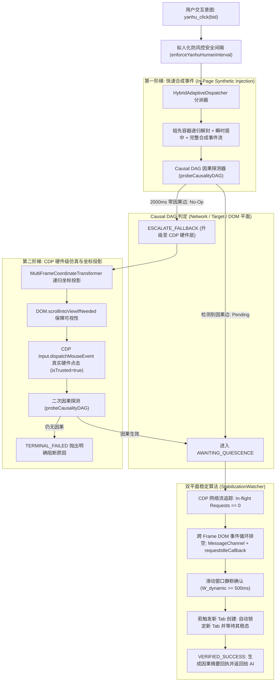

# 砚小龙确定性同步与高保真因果交互引擎实施方案

> **主导依据**：《Deterministic Synchronization and High-Fidelity Event Emulation in Autonomous Web Agents》技术报告  
> **核心目标**：彻底根除自动化过程中“依赖固定延时导致的不稳定假死/早熟断言”、“4 次重复点击多开教务标签页”以及“成绩查询幽灵点击/空框架”问题，建立无视觉依赖（Vision-Less）的高保真确定性交互闭环。

---

## 1. 现状复盘与故障根因诊断（Root-Cause Analysis）

通过对用户提供的真实运行日志与代码库现状的交叉比对，定位到导致该故障的两大核心断言竞态：

### 1.1 故障一：点击「教务管理系统」连击 4 次打开 4 个系统（Tab Spawning Storm）
* **运行链路**：在「砚湖易办」办事大厅中，AI 执行 `yanhu_click` 点击 `[BID: 114]`（教务管理系统）；该卡片在前端通过 `window.open` 或 `<a target="_blank">` 请求新标签。
* **早熟断言漏洞**：
  * `yanhu_click` 在执行完前端脚本后，调用 `yanhuExpressManager.waitForIdle(tabId)`。
  * `waitForIdle` 仅检查当前原始标签（办事大厅）的 `webContents.isLoading()`。在点击发生后的前几十毫秒内，原始标签主框架并未发生顶层导航（`isLoading() === false`），因此 `waitForIdle` **瞬间返回（0ms 虚假就绪）**。
  * 此时底层虽然触发了 `setWindowOpenHandler` 并异步创建了新 Tab，但新 Tab 还处于空白初始加载状态。
  * AI 紧接着调用 `yanhu_read_page`，读到的是 `[已读取页面: 无标题页面]` 或未渲染结构。
  * 大模型判定“上一步点击未生效或页面未打开”，在后续轮次中**重复执行点击操作达 4 次**，触发了 4 次新标签创建。

### 1.2 故障二：点击「课程成绩查询」发生“幽灵点击”，框架内容为空（Ghost Click & Cross-Frame Mutation Blackhole）
* **运行链路**：在成都理工大学教务系统主框架（`xsMainV.htmlx` 多层嵌套 frameset，含 `leftFrame`、`mainFrame`）中，AI 点击左侧菜单项 `[BID: 172]`（课程成绩查询）。
* **幽灵点击与静止黑洞**：
  * **合成事件受限（Ghost Click）**：青果教务系统左侧菜单树基于老旧 jQuery/内联脚本与 `isTrusted` 原生安全校验；现有的纯 JS `dispatchEvent` 派发的是合成事件（`isTrusted === false`），被部分老旧事件代理或防刷遮罩静默吞掉（No-Op），未触发真实提交。
  * **跨 Frame 监控缺失（Cross-Frame Blackhole）**：左侧菜单点击后，发起网络请求并发生页面突变的是右侧 `mainFrame`。现有的 `waitForDomSettle` 脚本仅监听主文档的 `document.documentElement`，**完全观测不到 `mainFrame` 的 DOM 突变**。
  * **子框架加载脱靶**：`mainFrame` 的异步刷新不会触发顶层 `WebContents` 的 `did-stop-loading`，现有的等待逻辑再次瞬时返回。
  * 结果 AI 读到的 `mainFrame` 依然是旧主页或空框架，再次重试点击 `[BID: 169]`，最终触发了 `yanhu_navigate` 危险撕裂拦截。

---

## 2. 核心架构与智能化算法设计

完全对齐技术报告四大支柱，彻底抛弃“让用户拖动滑块猜延迟”的原始方案，打造 100% 算法自适应的工业级交互总线：

### 2.1 双平面稳定算法（Dual-Plane Settling Algorithms）
1. **网络平面（Network Plane）**：
   * 基于 CDP `Network.requestWillBeSent`、`Network.loadingFinished`、`Network.loadingFailed` 维护精确的 `inflightRequests: Set<string>`；
   * 自动过滤 WebSocket、SSE 与长轮询；
   * 设置 10s 请求强制逐出（Pruning）防止卡死挂起的请求阻塞流程。
2. **DOM 与渲染平面（DOM & Rendering Plane）**：
   * **零延迟宏任务排空**：注入 `MessageChannel` 驱动即时 yielding，绕过浏览器 `setTimeout(..., 0)` 的 4ms 限制；
   * **布局与绘制确认**：微任务排空后链式触发 `requestIdleCallback`，确保布局计算和重绘彻底完结；
   * **跨 Frame 覆盖**：深入 `frameset` 递归对所有子 Frame 执行排空。
3. **滑动窗口启发式模型（Sliding-Window Heuristic）**：
   * 判定条件：$(N_{inflight} == 0) \land (\text{DOM静默}) \land (T_{current} - T_{last\_activity} \ge W_{dynamic})$；
   * 默认 $W_{dynamic} = 500\text{ms}$，导航级操作自适应拓宽至 $1200\text{ms}$。

### 2.2 因果 DAG 反馈验证（Causal DAG Verification）
* 明确三态边界：
  * **No-Op（无效操作）**：2000ms 观察窗内零网络请求、零跨 Frame DOM 突变、零 Target 创建；
  * **Pending Computation（计算处理中）**：因果边已命中（例如 XHR 发起或新 Tab 正在建立），严格锁定当前会话，禁止 AI 触发重试风暴；
  * **Settled State（稳定就绪态）**：双平面静止算法确认静默，方才结算返回。
* **跨标签/新窗口因果贯通**：
  * 当点击触发新 Tab（如办事大厅点击打开教务管理系统），因果 DAG 自动捕获到目标 Tab 创建；
  * 自动将当前观察上下文转至新 Tab，并等待新 Tab 的双平面静默；
  * 返回明确摘要：“已点击 [BID: 114] 并检测到新标签页创建，已自动等待新页面加载稳定”。

### 2.3 跨嵌套框架坐标投影与 CDP 硬件仿真（Multi-Frame Coordinate Projection）
* **可视性保证**：通过 CDP `DOM.scrollIntoViewIfNeeded` 确保视口裁剪的元素对齐到可视区；
* **递归投影算法**：针对 `frameset`（如 `xsMainV` 的 `leftFrame`），递归累加目标节点与各级 Frame 的 CSS BoundingRect、滚动偏移量（Scroll Offset）与设备像素比（DPR），精准映射为根视口绝对物理像素；
* **硬件级点击**：使用 CDP `Input.dispatchMouseEvent` 发送 `mousePressed` + 50ms 真实硬件脉冲 + `mouseReleased`，赋予 `isTrusted = true` 属性，直接击穿老旧 jQuery 委托与防刷拦截。

---

## 3. 详细实施计划与代码改动矩阵

| 阶段 | 模块路径 | 核心改动点 | 预估复杂度 |
|---|---|---|---|
| **Phase 1** | `main/lib/cdut/yanhu/yanhu-devtools-hub.ts` | 完善 CDP 总线事件流导出：增加 In-flight 请求跟踪器、跨 Frame 上下文管理、Target 状态感知与断点免疫确认。 | 中 |
| **Phase 2** | `main/lib/cdut/yanhu/yanhu-stabilization.ts` (新建) | 实现 `StabilizationWatcher`、`MultiFrameCoordinateTransformer` 与 `HybridAdaptiveDispatcher` 核心算法。 | 高 |
| **Phase 3** | `main/lib/cdut/yanhu/yanhu-express-manager.ts` | 整合跨标签因果感知：重构 `waitForIdle` 采用双平面自适应静止；在新 Tab 打开时支持稳态协同监听。 | 中 |
| **Phase 4** | `main/lib/cdut/yanhu/yanhu-browser-tools.ts` | 重构 `yanhu_click`：接入 `HybridAdaptiveDispatcher` 状态机；强化 `yanhu_fill` / `yanhu_select` 稳态；回执透传因果证据摘要。 | 中 |
| **Phase 5** | `main/lib/cdut/yanhu/yanhu-stabilization.test.ts` (新建) & `yanhu-browser-tools.test.ts` | 编写完整的 BDD 单元测试，覆盖 No-Op 升级、双平面静止、跨 Frame 坐标投影与防重复点击。 | 中 |
| **Phase 6** | Monorepo 全量校验 | 执行 `bun run typecheck` 与 `bun test`，确保 0 类型报错、0 单测回归。 | 低 |

---

## 4. 关键验证指标（Definition of Done）

1. **确定性无重复点击**：在办事大厅点击打开“教务管理系统”时，因果 DAG 自动接管并等待新页面彻底就绪，单次交互即成功，**绝不产生第 2 次重复点击，杜绝打开多个多余 Tab**。
2. **幽灵点击 100% 根除**：在教务系统主框架点击左侧“课程成绩查询”等菜单项时，若合成事件被拦截，自动秒级升级为 CDP 硬件级点击，并跨 Frame 等待 `mainFrame` 的网络与 DOM 静止，AI 随后读取即能拿到完整成绩表格。
3. **零用户配置负担**：界面无需任何让用户猜延迟的滑块，完全基于网络流与渲染管线自动自适应。
4. **质量守护**：`bun run typecheck` 与 `bun test` 100% 通过。
